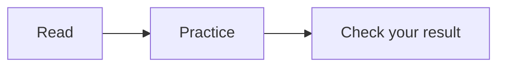
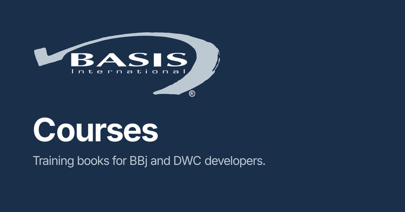

This page shows each shared component. Authors use it as a reference, and the Phase 3 checks read it.

## Exercise box

:::exercise
Read the next section and write down what each line does.
:::

:::exercise Change the title
This box sets its own title. The preceding box uses the default title.
:::

## Video

<YouTube id="9HQBN-PVHWs" title="BBj training video" />

## BBj code

```bbj
use java.util.HashMap

declare BBjNumber total!
total! = 0
msg$ = "She said ""hi"" to me"
print 'CS', msg$
count% = 3
for i = 1 to count% step 1
    total! = total! + i
next i
counter! = new Counter()
counter!.add(5)
print counter!.getCount(); rem show the count
gosub done
release

done:
    print "done"
return

class public Counter
    field private BBjNumber count
    method public void add(BBjNumber n)
        #count = #count + n
    methodend
    method public BBjNumber getCount()
        methodret #count
    methodend
classend
```

## Long code

This fence has 40 lines and stays open.

```javascript
const line01 = 1;
const line02 = 2;
const line03 = 3;
const line04 = 4;
const line05 = 5;
const line06 = 6;
const line07 = 7;
const line08 = 8;
const line09 = 9;
const line10 = 10;
const line11 = 11;
const line12 = 12;
const line13 = 13;
const line14 = 14;
const line15 = 15;
const line16 = 16;
const line17 = 17;
const line18 = 18;
const line19 = 19;
const line20 = 20;
const line21 = 21;
const line22 = 22;
const line23 = 23;
const line24 = 24;
const line25 = 25;
const line26 = 26;
const line27 = 27;
const line28 = 28;
const line29 = 29;
const line30 = 30;
const line31 = 31;
const line32 = 32;
const line33 = 33;
const line34 = 34;
const line35 = 35;
const line36 = 36;
const line37 = 37;
const line38 = 38;
const line39 = 39;
const line40 = 40;
```

This fence has 41 lines and collapses.

```javascript
const line01 = 1;
const line02 = 2;
const line03 = 3;
const line04 = 4;
const line05 = 5;
const line06 = 6;
const line07 = 7;
const line08 = 8;
const line09 = 9;
const line10 = 10;
const line11 = 11;
const line12 = 12;
const line13 = 13;
const line14 = 14;
const line15 = 15;
const line16 = 16;
const line17 = 17;
const line18 = 18;
const line19 = 19;
const line20 = 20;
const line21 = 21;
const line22 = 22;
const line23 = 23;
const line24 = 24;
const line25 = 25;
const line26 = 26;
const line27 = 27;
const line28 = 28;
const line29 = 29;
const line30 = 30;
const line31 = 31;
const line32 = 32;
const line33 = 33;
const line34 = 34;
const line35 = 35;
const line36 = 36;
const line37 = 37;
const line38 = 38;
const line39 = 39;
const line40 = 40;
const line41 = 41;
```

This block collapses through the component.

<ExpandableCode language="json" title="Long JSON sample">
{`"key01": 1,
"key02": 2,
"key03": 3,
"key04": 4,
"key05": 5,
"key06": 6,
"key07": 7,
"key08": 8,
"key09": 9,
"key10": 10,
"key11": 11,
"key12": 12,
"key13": 13,
"key14": 14,
"key15": 15,
"key16": 16,
"key17": 17,
"key18": 18,
"key19": 19,
"key20": 20,
"key21": 21,
"key22": 22,
"key23": 23,
"key24": 24,
"key25": 25,
"key26": 26,
"key27": 27,
"key28": 28,
"key29": 29,
"key30": 30,
"key31": 31,
"key32": 32,
"key33": 33,
"key34": 34,
"key35": 35,
"key36": 36,
"key37": 37,
"key38": 38,
"key39": 39,
"key40": 40,
"key41": 41,
"key42": 42,
"key43": 43,
"key44": 44,
"key45": 45`}
</ExpandableCode>

## Tabs

<Tabs>
  <TabItem value="first" label="First tab">
    The first tab holds one sentence.
  </TabItem>
  <TabItem value="second" label="Second tab">
    The second tab holds another sentence.
  </TabItem>
</Tabs>

## Card list

<DocCardList items={[
  {type: 'link', label: 'DWC overview', href: '/docs/\u0064wc/overview', description: 'The DWC book start page.'},
  {type: 'link', label: 'BBj Basics overview', href: '/docs/intro-\u0062bj/overview', description: 'The BBj book start page.'},
]} />

## Diagram



## Wide table

| Name | Type | Default | Scope | Mode | Unit | Range | Notes |
| --- | --- | --- | --- | --- | --- | --- | --- |
| alpha | string | none | local | read | chars | 0 to 10 | First sample row |
| beta | number | zero | global | write | bytes | 0 to 20 | Second sample row |
| gamma | boolean | false | session | both | none | 0 or 1 | Third sample row |

## Image zoom


