## Overview

This section deals with a traditional BBj GUI program that contains fields and a button and uses callbacks with the process_events model. After running the program in GUI, we'll run the program in BUI and the DWC. Next, we'll inspect the DWC app in the browser's Developer Tools and modify the appearance of a BBjButton by setting CSS styles and attributes on it. We will also take advantage of the DWC's Icon Pools and add an icon to the button. We'll then take a preliminary look at using CSS Grid for client-side layout, a topic that will be covered more in-depth later in the course. We'll wrap up by looking at handling errors in the browser's console.

## Concepts Covered in This Section

- Running a complete graphical BBj app in the thin client (GUI), the Browser User Interface (BUI), and the Dynamic Web Client (DWC)
- Changing the window to use flow layout, ignoring the x, y, width, and height parameters, and then applying a CSS Grid layout strategy
- Setting attributes on a BBjButton to affect its size and appearance
- Making our app look and act like a real web app instead of a desktop app running in the browser
- Handling runtime errors in the browser's Developer Tools console

## Sample Code

For this section, you will start by running the `GUISample.bbj` program in GUI (shown below), then in BUI, then in the DWC. You will then make modifications to the code to convert it to a DWC program that uses CSS Grid for layout.

{/* TODO: screenshot outdated? */}
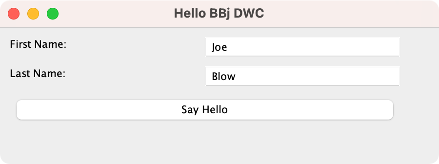

The training files also include programs named `DWC1.bbj` and `DWC2.bbj` that are the result of modifying the original `GUISample.bbj` program according to the exercises below.

## Program Notes

The program displays a dialog with inputs for the user's first and last names and a [Say Hello] button that greets the user by name when pressed.

- **`GUISample.bbj`** - Can run equally well in all three clients
- **`DWC1.bbj`** - Sets the `$00100000$` creation flag on the window to cause the DWC to ignore all size and position information for the controls. It adds styles to the window's panel to layout the controls using CSS Grid and sets attributes on the [Say Hello] button so that it is displayed as a very large green button.
- **`DWC2.bbj`** - Sets more window creation flags to hide the window's title bar and to set it to be initially maximized. It removes all the x, y, width, and height parameters from the controls.

## Example 1 - Running the App in GUI, BUI, and the DWC

1. Begin by loading the `GUISample.bbj` program and running it in GUI, BUI, and the DWC.
2. In at least one of the clients, fill in your first and last names in the BBjEditBoxes, then press the [Say Hello] button.
3. The program will display a message box with a customized greeting using your full name.

## Example 2 - Responsive Layouts

### Step 1: Enable Flow Layout

One of the major goals for the DWC was to provide the ability to use CSS for client-side layout. In addition to giving developers the ability to write responsive and dynamic apps that work well on a variety of devices and screen sizes, the layout occurs on the client and does not require any round trips to the server.

To enable flow layout on a window, set the `$00100000$` creation flag which tells the DWC to ignore all x, y, width, and height settings for the controls contained by the window.

Begin by changing the code to specify the `$00100083$` flags immediately following the window's title string in the line of code that instantiates the BBjTopLevelWindow. The controls now flow next to each other:

{/* TODO: screenshot outdated? */}
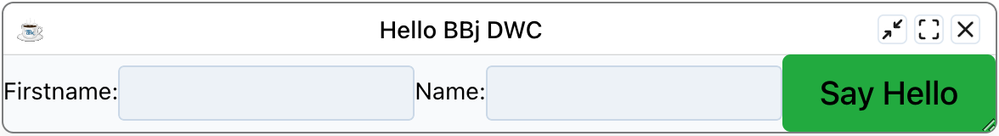

### Step 2: Add CSS Grid Styling

Now that the window uses a flow layout, provide some rudimentary CSS styling to the window panel using CSS Grid:

#### Method 1: Inside the BBj Code (used in this exercise)

```bbj
REM setting the styles into the style property of the element
wnd!.setPanelStyle("display","inline-grid")
wnd!.setPanelStyle("grid-template-columns","1fr 1fr")
wnd!.setPanelStyle("gap","5px")
```

#### Method 2: In an external CSS file

**BBj Code:**
```bbj
wnd!.addPanelStyle("mypanel")
```

**External CSS File:**
```css
.mypanel {
    display: inline-grid;
    grid-template-columns: 1fr 1fr;
    gap: 5px;
}
```

### CSS Grid Explanation

- `wnd!.setPanelStyle("display","grid")` - Sets the window to use CSS Grid for layout
- `wnd!.setPanelStyle("grid-template-columns","180px auto")` - Sets two vertical columns, with the first being 180 pixels wide and the second taking up remaining space
- `wnd!.setPanelStyle("gap","5px")` - Sets a 5-pixel gap between rows and columns
- `wnd!.setPanelStyle("padding","15px")` - Sets 15-pixel padding on the window

After the grid wraps its first row, it places the next controls in a new row. The `gap` value accepts other CSS units too, such as `0.25in` for a quarter of an inch, or a DWC custom property such as `var(--dwc-space-m)`. Custom properties scale with the font size, so they suit themes better than fixed pixels. For padding, `var(--dwc-space-xl)` gives an extra-large space, and `calc(var(--dwc-space-m) * 2)` doubles the medium space.

Both methods are valid, but in production use the external CSS file. With `setPanelStyle()`, the server runs each call in turn and sends the CSS to the client in separate steps, which is slower. For this exercise, adding the lines to the BBj program is easiest, because everything stays in one file.

After these changes, the app looks like this:

{/* TODO: screenshot outdated? */}
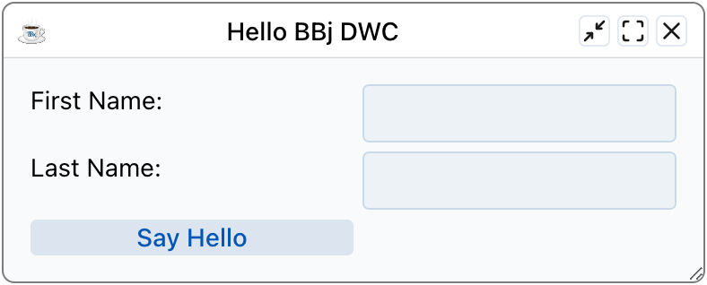

### Step 3: Button Spanning

To make the button span both columns, use either of these methods:

```bbj
btn!.setStyle("grid-column","1 / 3")  REM Sets button to start in column 1 and end before column 3
btn!.setStyle("grid-column","span 2") REM Sets button to span two grid columns
```

The button now spans both columns:

{/* TODO: screenshot outdated? */}
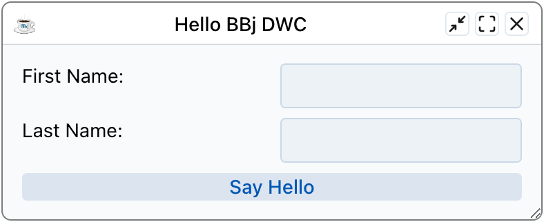

To place the button in the second column only:

```bbj
btn!.setStyle("grid-column","2")
```

The button now sits in column 2:

{/* TODO: screenshot outdated? */}
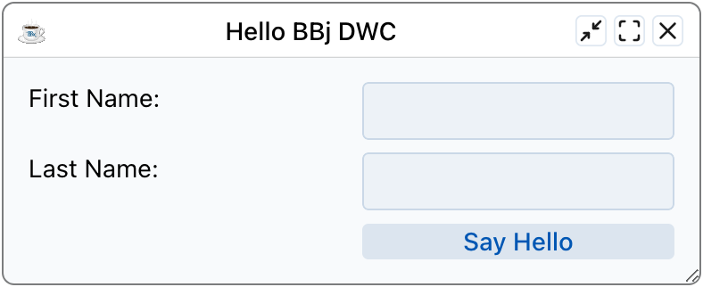

### Step 4: Understanding Window Structure

BBjTopLevelWindows and traditional BBjChildWindows are created from three nested DIVs:

```html
<div id="4" class="BBjDockedChildrenPanel BBjControl BBjTopLevelWindow-container">
    <div id="2" class="BBjWindow BBjControl bbj-0-0 BBjTopLevelWindow-center">
        <div id="3" class="BBjPanel BBjTopLevelWindow-content" tabindex="0">
            <!-- Various BBj Controls Contained by the Window -->
        </div>
    </div>
</div>
```

This is why we use `setPanelStyle()` instead of `setStyle()` - we're targeting the innermost panel that contains the controls.

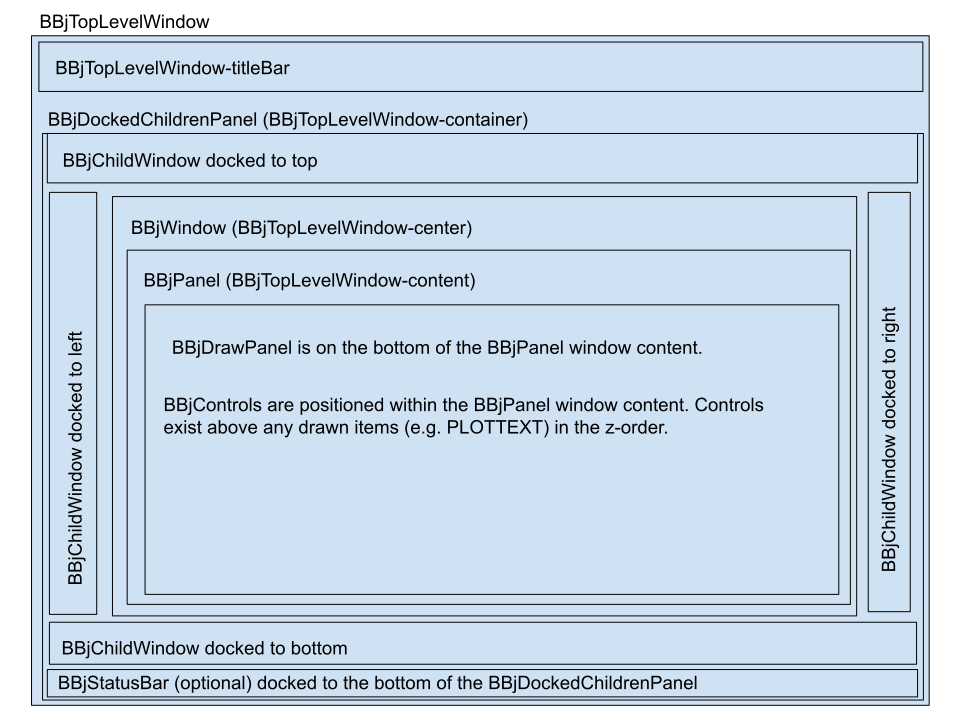

:::note
The DWC offers the ability to create windows using a simplified structure with just one DIV using the `BBjWindow::addChildWindow` method with appropriate flags.
:::

## Example 3 - BBjControl Attributes

The DWC-specific documentation for BBjButton displays a Properties table with attributes that we can use with the `setAttribute()` method.

### Step 1: Set Expanse

Set the button's 'expanse' attribute to 'xl' so that the button is extra large:

```bbj
btn!.setAttribute("expanse", "xl")
```

### Step 2: Set Theme

Set the button's 'theme' attribute to the 'success' component theme (green color):

```bbj
btn!.setAttribute("theme", "success")
```

Try experimenting with 'danger' or 'info' themes as well. With `expanse` set to `xl` and the `success` theme, the button looks like this:

{/* TODO: screenshot outdated? */}
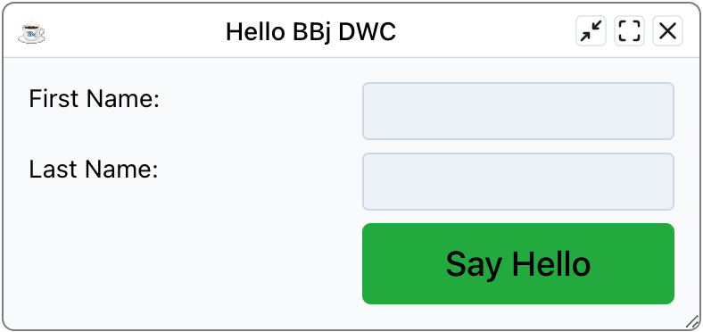

## Example 4 - Making a Real Web App

### Step 1: Remove Window Chrome

Change the window's creation flags from `$00100083$` to `$01101083$`. This instructs BBj to create the window without a title bar and initially maximized. The grid now fills the whole browser window and the second column becomes very wide:

{/* TODO: screenshot outdated? */}
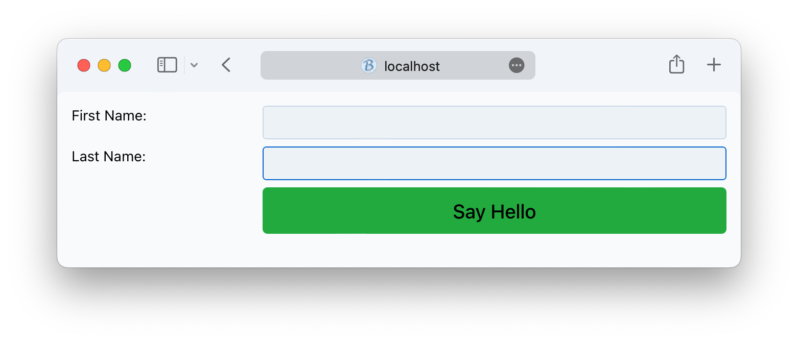

### Step 2: Fix Column Widths

Make the layout dynamic:

```bbj
wnd!.setPanelStyle("display","inline-grid")  REM Prevents grid from taking full width
wnd!.setPanelStyle("grid-template-columns","1fr 2fr")  REM Right column is twice as wide as left
```

The layout is now compact:

{/* TODO: screenshot outdated? */}
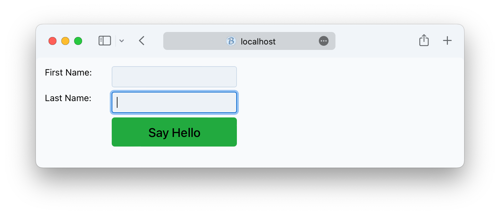

### Step 3: Clean Up Code

Remove the x, y, width, and height parameters if you're only running in DWC:

```bbj
st! = wnd!.addStaticText("First Name:")
ed_firstname! = wnd!.addEditBox("")
st! = wnd!.addStaticText("Last Name:")
ed_lastname! = wnd!.addEditBox("")
btn! = wnd!.addButton("Say Hello")
```

## Going the Extra Mile

### Auto-switch to DWC

Add code at the top of the program to forcefully run the app in the DWC if it was launched in BUI:

```bbj
rem If the app is running in BUI, switch it automatically to run in the DWC client instead
if (info(3, 6) = "5") then
    bui! = BBjAPI().getBuiManager()
    url! = bui!.getUrl().replaceAll("apps", "webapp")
    action! = bui!.urlAction(url!)
    bui!.setEndAction(action!)
    release
endif
```

### Mobile Device Fixes

When running on iOS, the phone may zoom into the form when focusing on input controls. Fix this with one of these methods:

**Method 1: Change the font size to 16px:**
```bbj
wnd!.setStyle("font-size","16px")
```

iOS zooms into a form when an input control has a font size below 16 pixels. The DWC base font is smaller than that, so the zoom happens unless you raise the size, for example through the `--dwc-font-size` custom property.

**Method 2: Set a meta tag to prevent scaling:**
```bbj
web! = BBjAPI().getWebManager()
web!.setMeta("viewport","width=device-width,initial-scale=1,user-scalable=no,minimal-ui")
```

This method stops users from zooming in and out. Turn off user scaling only when your layout is responsive. Otherwise leave zoom on, because users may need it to read the page.

## Example 5 - Error Handling

When you make a mistake in your code, you have two ways to deal with runtime errors:
- The mini console
- The browser's Developer Tools Console

### Testing Error Handling

Add code similar to the following just before the `process_events` line:

```bbj
print btn!
escape
```

Run the program in the DWC. The button information is displayed both in the BBj console and the Developer Tools' Console tab.

The BBj mini console:

{/* TODO: screenshot outdated? */}
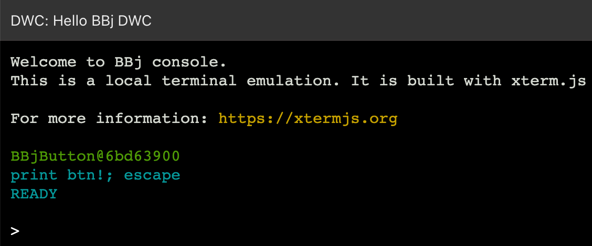

The browser Developer Tools Console:

{/* TODO: screenshot outdated? */}
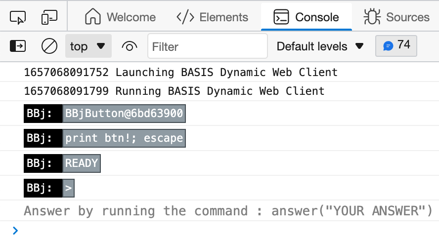

Try interacting with the BBj console by printing out the date:

```bbj
? date(0)
```

In the browser console, you can run the same check with `answer("? date(0)")`.

:::tip
The DWC's mini console is still fairly rudimentary compared to the BUI mini console, but it's useful for printing out the value of objects and variables to aid in debugging.
:::
