## Overview

This section covers inspecting, modifying, adding, and deleting CSS styles on BBjControls. It also covers the DWC's CSS custom properties and how to access them to style your app.

## Concepts Covered in This Section

- The DWC's CSS custom properties
- The DWC's App Themes
- Modifying a BBjControl's Style Properties
- Using Directives to Inject JavaScript and CSS Dynamically
- The Web Component Architecture and the Shadow DOM
- Font Size Compatibility

## The DWC's CSS Custom Properties

CSS custom properties (also known as CSS variables) are dynamic entities that contain values often reused throughout a web page or DWC app.

### Syntax

Custom properties are set using notation that starts with two dashes:

```css
--dwc-color-black: #000;
```

Values are accessed using the `var()` function:

```css
color: var(--dwc-color-black);
```

### Naming Convention

- Start with two dashes (`--`)
- All lowercase
- Use single dashes to separate words

### Benefits

- Store a value in one place, reference it everywhere
- Change the definition once and propagate throughout the app
- No more tedious global search and replacement

### Fallback Values

CSS custom properties support fallback values:

```css
color: var(--dwc-button-color, red);
```

This sets the color to `--dwc-button-color`, or `red` if undefined.

:::tip
View all DWC CSS custom properties by switching to the Application tab in Developer Tools and viewing the `dwc-ui.css` file. The file is minified, but the Developer Tools can toggle it between the minified state and a pretty-printed (formatted) version, which is much easier to read.
:::

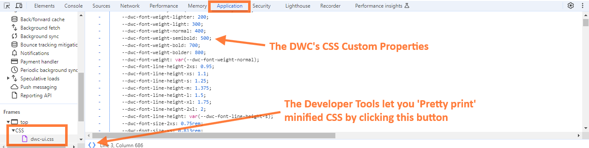

## Example 1 - Setting Custom Values for CSS Custom Properties

### Step 1: Run the Example

Load `CSSCustomProperties.bbj` from the `02_CSSStylesAndCustomProperties` folder and launch it as a BUI program. It will automatically relaunch in the DWC.

### Step 2: Experiment

Choose different CSS custom properties and values, then press the button to apply changes:

```bbj
sampleWindow!.setStyle(currentProperty$, currentValue$)
```

The following screenshot shows the result of setting `--dwc-color-primary` to `orange`. The background of the check box and the radio button changes to orange:

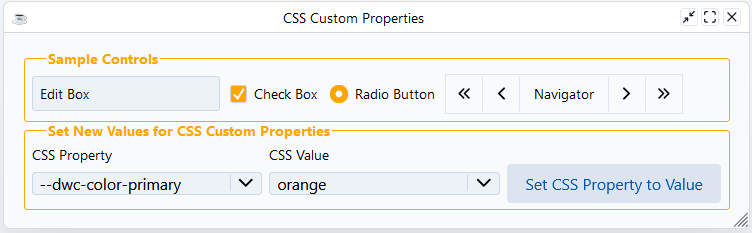

### Going the Extra Mile

Modify the window title by adding CSS properties:

```bbj
newValue!.addClass("fieldSet")
css! = css! + "fieldSet legend {"
css! = css! + "    color: var(--dwc-color-primary);"
css! = css! + "    font-weight: bold;"
css! = css! + "    text-align: center;"  REM Add this line
css! = css! + "}"
```

## The DWC's App Themes

The DWC offers three built-in app themes: `light`, `dark`, and `dark-pure`.

### Setting Themes

```bbj
rem Get the WebManager to apply themes
web! = BBjAPI().getWebManager()

rem Set the DWC dark theme
web!.setDarkTheme("dark")

rem Set the DWC light theme
web!.setLightTheme("light")

rem Use system preferences automatically
web!.setTheme("system")
```

### Example Programs

- **`UserPreference.bbj`** - Follows the client's OS light/dark setting
- **`Themes.bbj`** - Always displays using DWC's dark theme
- **`DWCThemer.bbj`** - Applies a CSS theme created by the DWC Themer utility

## Example 2 - Setting a DWC App to Dark Mode

Add one of the theme lines to `CSSCustomProperties.bbj`:

```bbj
web! = BBjAPI().getWebManager()
web!.setTheme("system")
```

If the client's operating system is in dark mode, the sample window now displays with the DWC dark theme:

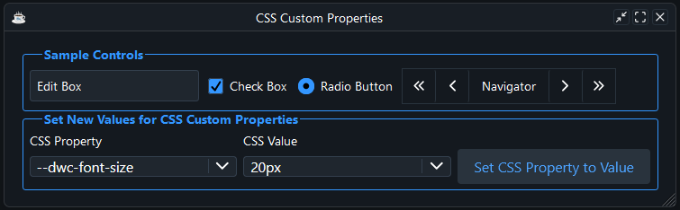

## Modifying a BBjControl's Style Properties

There are several ways to set styles on a BBjControl:

### Method 1: setStyle() with CSS

```bbj
myButton1!.setStyle("background", "purple")
myButton1!.setStyle("color", "yellow")
```

### Method 2: injectStyle() with Class

```bbj
myButton2Css! = ".myButton2 {"
myButton2Css! = myButton2Css! + "    background: purple;"
myButton2Css! = myButton2Css! + "    color: yellow;"
myButton2Css! = myButton2Css! + "}"
myButton2!.addClass("myButton2")
web!.injectStyle(myButton2Css!)
```

:::warning
This method doesn't produce the expected results because of the shadow DOM. The explanation follows the examples.
:::

The code for `myButton1!` and `myButton2!` both tries to set the foreground and background color of the button, but only `myButton1!` works as expected. If you look closely at the second button, you can see that its corners are purple. The purple background sits behind the button's "control" part, and only the corners show because of the button's border radius.

`BBjButton` inherits `setBackColor()` and `setForeColor()` from `BBjControl`, and both use the `setStyle` message internally, which is the method `myButton1!` uses. The DWC intercepts `setStyle` calls and forwards the color and the background to the correct part of the component. That trick does not work for an injected class, so `myButton2!` misses the button face. The shadow DOM section below explains why the third and fourth buttons work.

### Method 3: CSS Custom Properties

```bbj
myButton3Css! = ".myButton3 {"
myButton3Css! = myButton3Css! + "    --dwc-button-background: purple;"
myButton3Css! = myButton3Css! + "    --dwc-button-color: yellow;"
myButton3Css! = myButton3Css! + "}"
myButton3!.addClass("myButton3")
web!.injectStyle(myButton3Css!)
```

### Method 4: Shadow DOM Parts

```bbj
myButton4Css! = ".myButton4::part(control) {"
myButton4Css! = myButton4Css! + "    background: purple;"
myButton4Css! = myButton4Css! + "    color: yellow;"
myButton4Css! = myButton4Css! + "}"
myButton4!.addClass("myButton4")
web!.injectStyle(myButton4Css!)
```

The result shows four buttons. Buttons 1, 3, and 4 are purple with yellow text. Only the second button, styled with the injected class, stays unstyled:

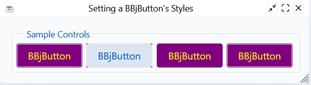

## Using Directives to Inject JavaScript and CSS Dynamically

### Reading External CSS Files

**Method 1: Using DemoUtils**
```bbj
style! = DemoUtils.getFileContents(dsk("")+dir("")+"style.css")
web! = BBjAPI().getWebManager()
web!.injectStyle(css!, top)
```

**Method 2: Using Java's Files and Paths**
```bbj
use java.nio.file.Files
use java.nio.file.Paths
css! = new String(Files.readAllBytes(Paths.get(BBjAPI().getFileSystem().resolvePath("./style.css"))))
web! = BBjAPI().getWebManager()
web!.injectStyle(css!, top)
```

**Method 3: Using BBj open/readrecord/close**
```bbj
chan = unt
open(chan, isz = -1)"./style.css"
readrecord(chan, SIZ = -10000000)css$
close(chan)
web! = BBjAPI().getWebManager()
web!.injectStyle(css$, top)
```

## The Web Component Architecture and the Shadow DOM

### What are Web Components?

Web components are a suite of technologies for creating reusable custom controls:

| Technology | Description |
|------------|-------------|
| **Custom Elements** | JavaScript APIs for defining custom elements and their behavior |
| **Shadow DOM** | APIs for attaching encapsulated DOM trees, keeping features private |
| **HTML Templates** | `<template>` and `<slot>` elements for reusable markup |

### DWC vs BUI

The DWC implements BBj controls using web components with shadow DOMs:

**DWC Button (simplified):**
```html
<dwc-button>...</dwc-button>
```

In the Elements tab, the real outer HTML of a DWC button, without the inline styles, is short:

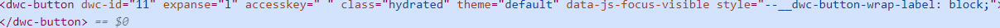

**BUI Button (more complex outer HTML):**
```html
<div class="BBjButton">...</div>
```

The same button in BUI has much more markup:

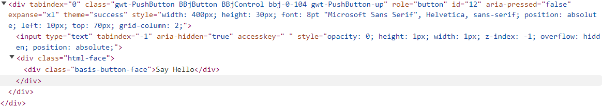

### Why Shadow DOM?

Shadow DOM isolates web components from the regular DOM, preventing:
- Global styles from affecting component internals
- Component styles from affecting page content

### Styling Shadow DOM Elements

**Method 1: CSS Custom Properties**

Shadow trees inherit CSS custom properties from their host:

```bbj
web! = BBjAPI().getWebManager()
web!.setStyle("background", "purple", "dwc-button")
```

**Method 2: CSS Shadow Parts (::part)**

Target exposed parts of the shadow DOM:

```bbj
myButton4Css! = ".myButton4::part(control) {"
myButton4Css! = myButton4Css! + "    background: purple;"
myButton4Css! = myButton4Css! + "    color: yellow;"
myButton4Css! = myButton4Css! + "}"
```

The `::part(control)` pseudo-element targets the button's exposed "control" part.

A pseudo-element is a keyword you add to a selector to style a specific part of the selected elements. The class name `myButton4` matches the button, and `::part()` reaches into the button's shadow DOM to select the element that exposes the named part. To see all exposed parts, inspect the `dwc-button` in the Developer Tools and expand the first shadow tree:

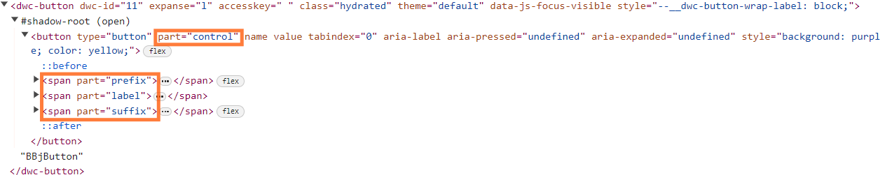

The first highlighted attribute shows that the button uses an HTML `button` element with `part="control"`. That is the element the `.myButton4::part(control)` selector targets, so the background and foreground colors override the control's defaults. Compare the code below:

```bbj
    css! =        ".myButton4::part(control) {"
    css! = css! + "   background: purple;"
    css! = css! + "   color: yellow;"
    css! = css! + "}"
```

Change `control` to `label` in the first line and the selector targets the "label" part of the button instead, which gives a very different result. With `::part(control)` the whole button is purple:

{/* TODO: screenshot outdated? */}
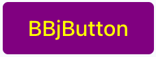

With `::part(label)` only the label area is purple, and the other areas of the button keep their default style:

{/* TODO: screenshot outdated? */}
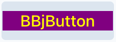

:::note
Inheritable styles (background, color, font, line height, etc.) continue to inherit in shadow DOM and can penetrate the shadow DOM boundary. Outside styles always win over styles defined in shadow DOM.
:::

:::tip Finding CSS Properties and Parts
Each DWC control exposes different CSS custom properties and shadow parts. Use **[`dwc.style`](https://dwc.style/)** to look up the available properties and parts for any control. Select a control from the sidebar to see its CSS custom properties, shadow parts, and attributes.
:::

## Font Size Compatibility

The DWC has a larger default font size (14px) compared to BUI (10.6667px / 8pt). When you run the same app in BUI and in the DWC, the text in BUI is noticeably smaller. Compare the same `BBjListBox` in both clients. In BUI, on the left, three entries fit with room to spare:

{/* TODO: screenshot outdated? */}
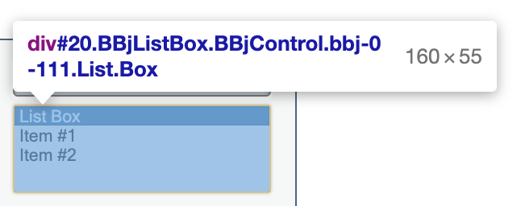

In the DWC, the list box has exactly the same size of 160 by 55 pixels, but only one item is fully visible. The second item is cut off, and you have to scroll to reach the third:

{/* TODO: screenshot outdated? */}
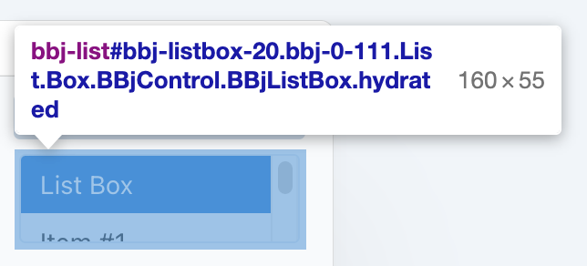

The difference comes from the default font size and the spacing. The Computed styles section of the Developer Tools shows that the two clients define the CSS `font-size` property very differently. In BUI, the size is 10.6667px, and expanding the property shows that it traces back to 8pt in the `basis.css` file:

{/* TODO: screenshot outdated? */}
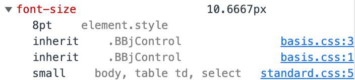

In the DWC, the size comes from the `--dwc-font-size` CSS custom property, which resolves to 14px.

Points and pixels are not the same, but both are fixed-size units. A pixel is one picture element on your screen. A point is 1/72 of an inch. One point equals 1.3333 pixels, and one pixel equals 0.75 points, so BUI's 8pt font converts to 10.6667px.

### Making DWC Look Like BUI

**Method 1: Using LEGACY_FONTS**
```bbj
temp$ = STBL("!COMPAT","LEGACY_FONTS=TRUE")
```

:::warning
This only affects controls added AFTER this line is executed.
:::

**Method 2: Setting font-size CSS property**
```bbj
myWindow!.setStyle("font-size","8pt")
```

## Example 3 - Font Sizes

1. Compare the app running in BUI (`/apps/` context) vs DWC (`/webapp/` context)
2. In Developer Tools, select a BBjStaticText control and view Computed styles
3. DWC default font-size: 14px (from `var(--dwc-font-size)`)
4. BUI default font-size: 10.6667px (8pt from `basis.css`)
5. Use either STBL or setStyle to match sizes if needed
