This chapter covers different CSS layout strategies to make responsive BBj applications in the Dynamic Web Client.

## Overview

Many projects use multiple layout strategies, as some are better suited to certain tasks than others. A DWC app can mix and match CSS layout techniques to build responsive apps that adapt to the client's display.

## CSS Layout Options

### CSS Flexbox

A flexible box layout designed for **one-dimensional layout** (row or column).


**Best for:**
- Windows with a few controls positioned next to one another
- Horizontal (`flex-direction: row`) or vertical (`flex-direction: column`) layouts

**Key features:**
- Controls grow/shrink to fit available space
- Flexible ordering of items

### CSS Grid

A grid-based layout system with **two-dimensional layout** (rows and columns).


**Best for:**
- Complex forms
- More control over size and position
- Controls spanning multiple rows or columns

Flexbox and grid both fit many scenarios, and some cases work better with one than the other. To set the horizontal and vertical alignment of a single control in a window, flexbox is the easiest solution. A single-column or single-row grid works too. If controls in one row of a wrapped flexbox container must line up with the controls above them, the two-dimensional grid is the better choice.

Flexbox supports fewer properties and values than the grid, so the grid model can be much more complex. The CSS grid has 18 properties that affect its configuration, plus 10 more for the items inside the grid. This page does not list all of them. The [CSS-Tricks Complete Guide to Grid](https://css-tricks.com/snippets/css/complete-guide-grid/) documents them with examples and drawings.

### Media Queries

Conditional CSS that changes layout based on screen size:

```css
@media (min-width: 600px) {
    .my-window {
        grid-template-columns: auto 1fr auto 1fr;
    }
}
```

You can think of a media query as an if/then structure. The `@media` rule holds a block of CSS properties that only take effect when the conditions are true. The conditions can combine `and`, `or` and `not` for flexible logic.

Developers commonly use media queries to change the layout based on the width or height of the screen. For example, a CSS grid can have six columns on a wide screen, four columns on a normal screen and one column on a phone in portrait orientation. Combining CSS grid with media queries makes it easy to define separate layouts for desktop, tablet and phone.

A condition can also test the device orientation, so you can define different layouts for portrait and landscape. Besides changing the size or number of columns, media queries can hide elements on small screens, adjust the font size to the screen size, or adapt content for users with accessibility needs.

## CSS Flexbox Properties

| Property | Description |
|----------|-------------|
| `flex-direction` | `row`, `column`, `row-reverse`, `column-reverse` |
| `flex-wrap` | `nowrap` (default), `wrap`, `wrap-reverse` |
| `justify-content` | Alignment along main axis |
| `align-items` | Alignment along cross axis |
| `gap` | Space between items |
| `order` | Explicit ordering of items |
| `flex-grow` / `flex-shrink` | How items grow/shrink |

## CSS Grid Properties

### Defining the Grid

```css
display: grid;
grid-template-columns: 180px auto;
grid-template-rows: 1fr 2fr 2fr 1fr;
gap: 10px;
```

### Placing Controls

**Method 1: Grid lines**
```css
grid-column: 1 / 3;  /* Start line 1, end line 3 */
grid-column: 1 / span 2;  /* Start line 1, span 2 columns */
```

**Method 2: Named areas**
```css
grid-template-areas:
    "header header header"
    "sidebar content content"
    "sidebar footer footer";
```

To try named areas, open the [CSS Grid Playground](https://www.cssgridplayground.com). In its example, the bottom row is defined as `sidebar footer footer`. The sidebar extends into the bottom row and takes up the first column, which is set to `1fr`. The `fr` unit is a fractional unit, a flexible length that represents a fraction of the leftover space in the grid container. The footer is listed twice, so it starts in the second column and extends into the third. Its width is the width of columns 2 and 3 plus the gap between them, or `5fr + 2.5fr + 1rem`, which is `7.5fr + 1rem`.

To experiment, change the bottom row from `sidebar footer footer` to `sidebar footer aside`. The sidebar still takes up the first column, but the footer now only takes up the second column. The `aside` area extends down into the third column:

{/* TODO: screenshot outdated? */}
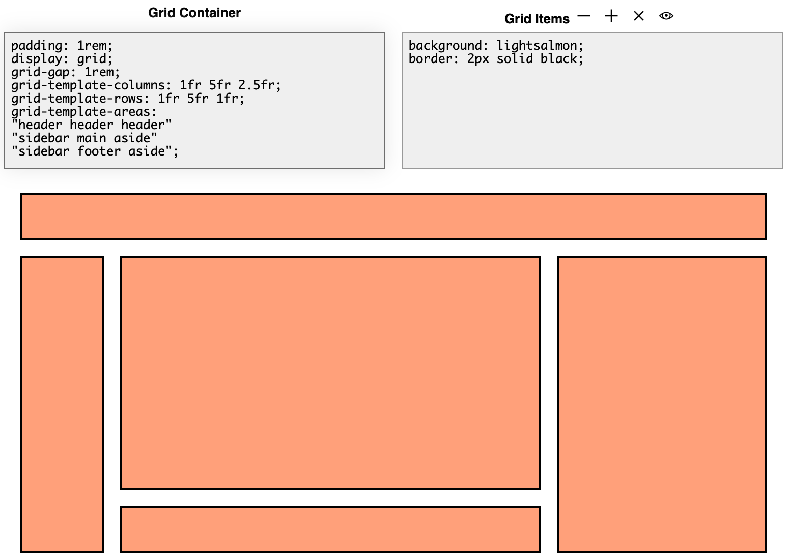

**Method 3: Row and column templates**

Instead of positioning each item, you can define the row and column templates of the grid. The controls then fill the grid automatically, so you set no styles on the items. For many developers this is the easiest way to work with CSS grid. It is also much more succinct, because you do not set the start, end or span for each item.

In the following screenshot, `grid-template-columns` is set to `25% 1fr`. That gives two columns: the first takes 25% of the available width and the second takes all the remaining space. `grid-template-rows` is set to `1fr 2fr 2fr 1fr`, which defines four rows. The first and last rows take `1fr` of the height, and the middle two rows are each twice as high.

{/* TODO: screenshot outdated? */}
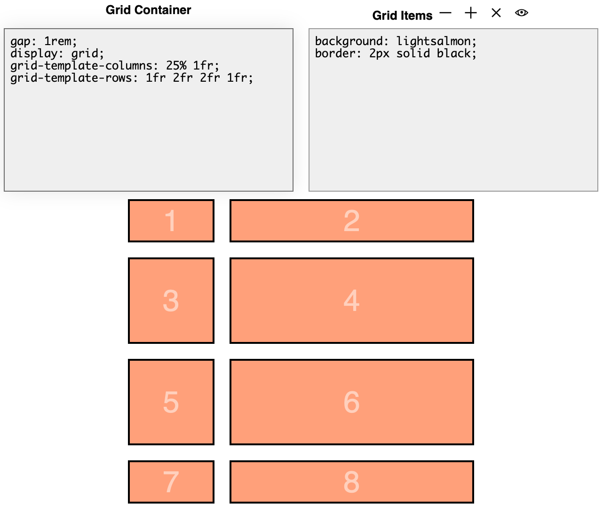

The `DWC1.bbj` program from the first chapter uses this method for its layout:

```bbj
    wnd!.setPanelStyle("display","grid")
    wnd!.setPanelStyle("grid-template-columns","180px auto")
```

That code sets the window to use a grid, then defines two template columns: the first is 180 pixels wide and the second takes the remaining space. With two controls in the window, you get a grid with one row and two columns. Each additional control fills the next cell, row by row, until you have the final form. The next screenshot shows the Developer Tools grid overlay on top of the window to visualize the columns:

{/* TODO: screenshot outdated? */}
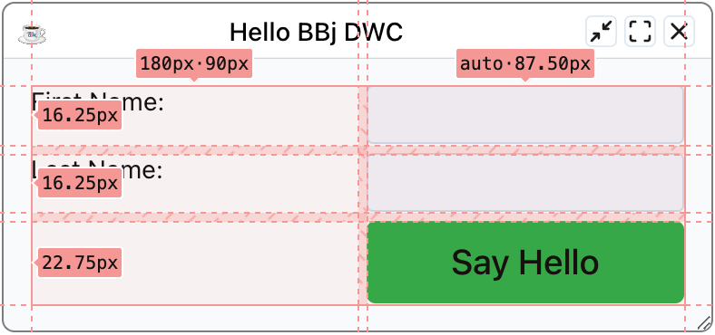

### Responsive Grids with repeat()

```css
display: grid;
grid-template-columns: repeat(auto-fit, minmax(10ch, 1fr) minmax(20ch, 2fr));
```

This creates columns that repeat as needed to fill the container, with minimum sizes.

The `repeat()` function represents a repeated fragment of the track list. It lets you write a large number of columns or rows with a recurring pattern in a compact form. These two definitions resolve to the same grid:

```css
grid-template-columns: auto 1fr auto 1fr;
grid-template-columns: repeat(2, auto 1fr);
```

The `2` tells the grid to repeat the pattern `auto 1fr` twice. The first value can also be `auto-fit` or `auto-fill`. Then the tracks repeat as many times as needed to fill the grid container. The `minmax()` function defines a size range from a minimum to a maximum value.

Here is how the example breaks down. The first line, `display: grid;`, sets the window to use the CSS grid. In the second line:

- The code sets `grid-template-columns` but not `grid-template-rows`. The grid defines the width and number of columns and keeps adding rows as you add controls.
- `repeat()` with `auto-fit` repeats the columns as often as needed to fill the grid container, which is the BBjWindow.
- The first column is `minmax(10ch, 1fr)`. It is at least 10 characters wide and can grow to one fractional unit.
- The second column is `minmax(20ch, 2fr)`. It is at least 20 characters wide and can grow to two fractional units, so it ends up twice as wide as the first.

In practice, the result depends on the available space. A narrow window only has room for two columns. As the window gets wider, `auto-fit` adds more columns in groups of two, as the three screenshots in the responsive form example below show.

## Fractional Units (fr)

The `fr` unit represents a fraction of remaining space:

```css
/* These look similar but behave differently with gaps/padding */
grid-template-columns: 25% 75%;      /* Absolute percentages */
grid-template-columns: 1fr 3fr;      /* Fractional - adjusts for gaps */
```

:::tip
Use `fr` units instead of percentages to avoid overflow when using gaps and padding.
:::

Both settings make the first column a third of the size of the second, but percentages are absolute shares of the space. The `fr` unit splits the space that remains after the other content is placed. Once you add a gap between rows and columns or padding around the grid, part of the space is already taken. The width then adds up to `padding + 25% + gap + 75% + padding`, which is more than 100%, so the grid contents exceed the width of the container. With `fr` units, the grid subtracts the padding and the gap from its total width first, then divides the remaining space by 4 to get the value of `1fr`.

The CSS-Tricks article [An Introduction to the fr CSS Unit](https://css-tricks.com/introduction-fr-css-unit/) covers this topic in depth with working examples.

## Example 1 - CSS Flexbox

Run `DWCTraining/05_CssLayouts/DWCFlexbox.bbj`:
1. Select different flexbox settings
2. Observe how boxes change with window resize
3. Click [Show CSS] to see the generated styles

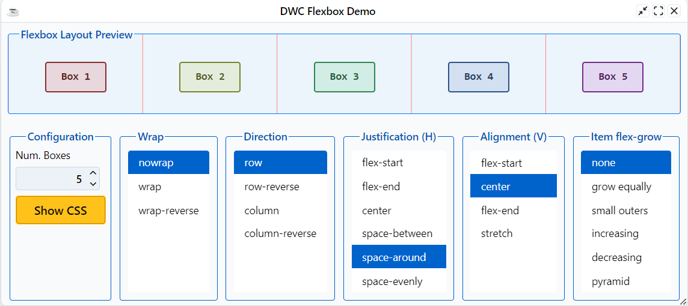

After picking a layout style, click the **[Show CSS]** button to see the CSS styles and BBj code:

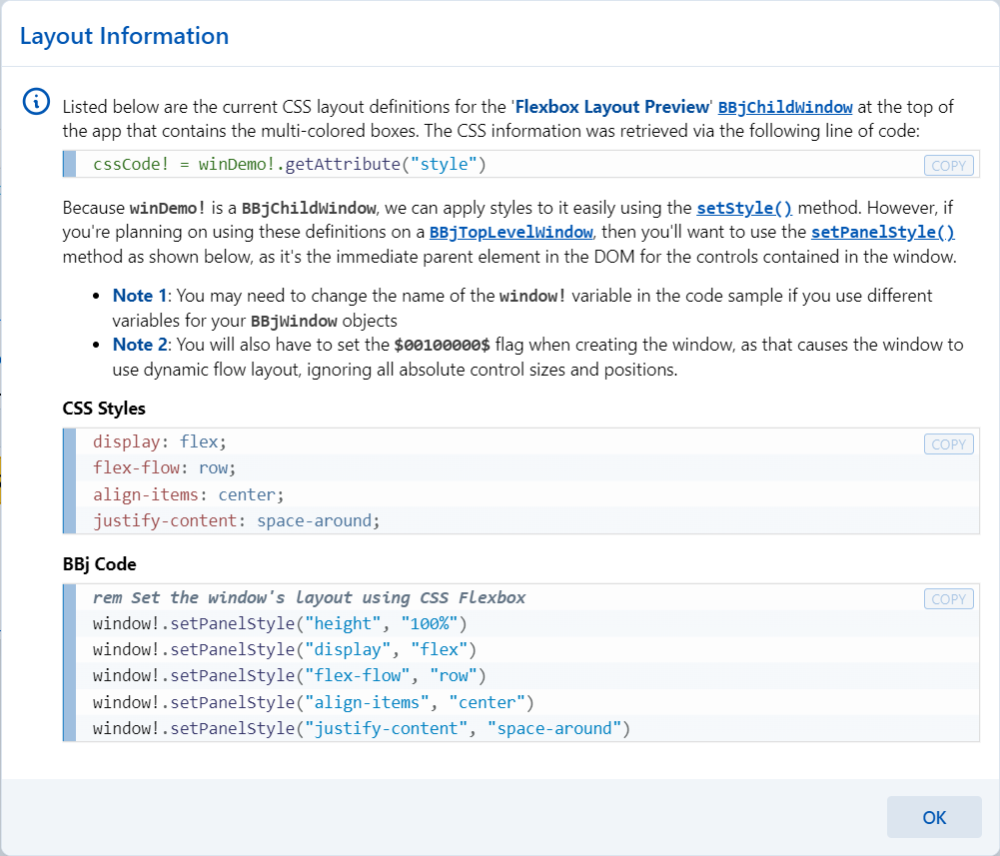

## Example 2 - CSS Grid Layouts

Run `DWCTraining/05_CssLayouts/DWCGrid.bbj`:
1. Choose different layouts from the list
2. Layouts 1-4: Basic column definitions
3. Layouts 5-6: Fixed four columns (truncated when narrow)
4. Layout 7: `repeat(auto-fit, 100px 200px)` - columns increase with width
5. Layout 8: Media queries for 2/4/6 columns based on viewport
6. Layout 9: `minmax()` for flexible column widths

Layouts 1 and 2 use `auto 1fr` and `1fr auto` to show that the grid treats fractional units differently from `auto`. When you use both together, the fractional unit wins by grabbing most of the available space. Layouts 5 and 6 always use four columns, so the controls are truncated when the form is narrow. Layouts 7 to 9 solve that problem.

Layout 8 uses media queries to set different column templates based on the width of the viewport. For this to work well, the window must be maximized to take the full width of the browser. To test it, maximize the app in the browser, open the browser's Developer Tools and select the Device Emulation tab. Choose the "Responsive" option. In Responsive mode you can resize the viewport by dragging the handles with the orange outlines, which is easier than resizing the whole browser window, especially when the Developer Tools sit below the page. You can also type exact values for the viewport size, as outlined in purple in the screenshot.

{/* TODO: screenshot outdated? */}
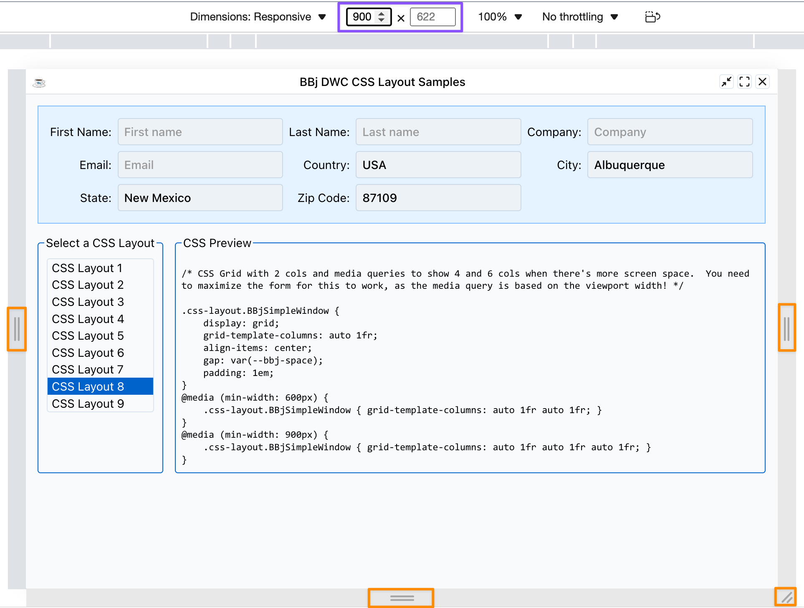

As you change the width of the viewport, the DWC app shows 2, 4 or 6 columns of controls. These media queries create the four-column and six-column versions:

```css
@media (min-width: 600px) {
    .css-layout.BBjSimpleWindow { grid-template-columns: auto 1fr auto 1fr; }
}
@media (min-width: 900px) {
    .css-layout.BBjSimpleWindow { grid-template-columns: auto 1fr auto 1fr auto 1fr; }
}
```

The original grid definition has two columns, followed by the CSS above. Because the media queries appear later, they override the window's original CSS when their condition is true. At a viewport width of 600 pixels or more, `grid-template-columns` becomes `auto 1fr auto 1fr`, the four-column mode. At 900 pixels or more, it becomes the six-column mode. Layouts 7 and 9 can achieve similar results without media queries.

{/* TODO: screenshot outdated? */}
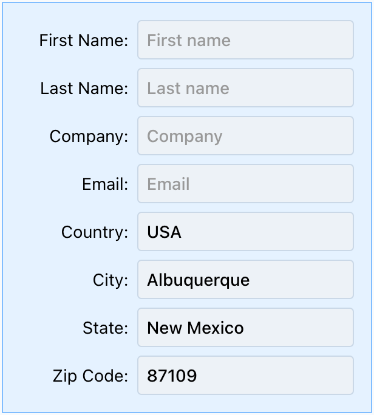

You can also experiment with CSS Grid layouts at [cssgridplayground.com](https://www.cssgridplayground.com):

{/* TODO: screenshot outdated? */}
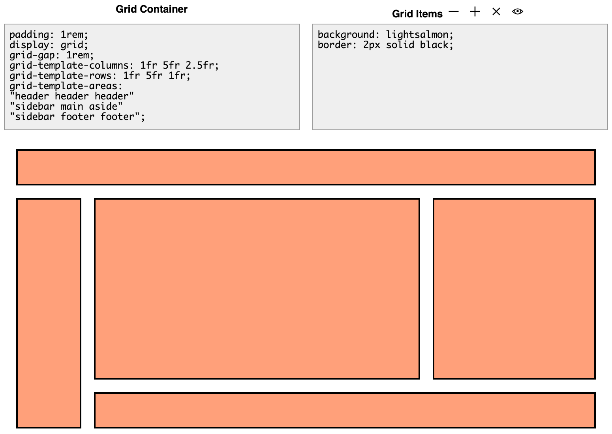

### Responsive Form Example

Using CSS Grid with `repeat(auto-fit, ...)`, forms automatically adjust columns based on available width:

**Narrow window (2 columns):**
{/* TODO: screenshot outdated? */}
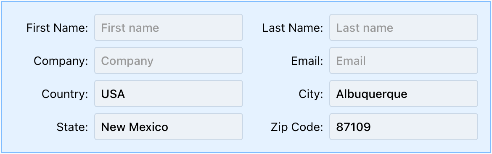

**Medium window (4 columns):**
{/* TODO: screenshot outdated? */}
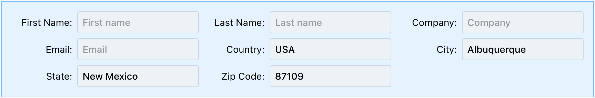

**Wide window (6 columns):**
{/* TODO: screenshot outdated? */}
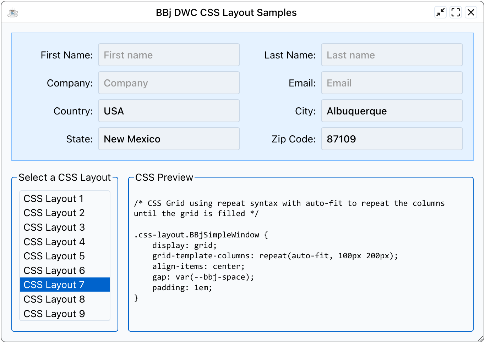

## Justification and Alignment

| Property | Axis | Affects |
|----------|------|---------|
| `justify-items` | Horizontal | Items in grid |
| `align-items` | Vertical | Items in grid |
| `justify-content` | Horizontal | Entire grid in container |
| `align-content` | Vertical | Entire grid in container |
| `justify-self` | Horizontal | Override for single item |
| `align-self` | Vertical | Override for single item |

Justification aligns along the inline axis (rows, horizontal) and alignment aligns along the block axis (columns, vertical). In a grid, justification always deals with rows and alignment always deals with columns. In flexbox, the two flip depending on whether you are in row mode or column mode.

`justify-content` and `align-content` only have an effect when the grid is smaller than its container. If the grid takes up the full size of the container, they do nothing. `justify-self` and `align-self` override the container's alignment for a single item, for example to right-align one button in its cell.

## Resources

- [CSS-Tricks: Complete Guide to Flexbox](https://css-tricks.com/snippets/css/a-guide-to-flexbox/)
- [CSS-Tricks: Complete Guide to Grid](https://css-tricks.com/snippets/css/complete-guide-grid/)
- [CSS Grid Playground](https://www.cssgridplayground.com)
