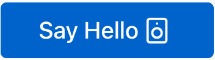
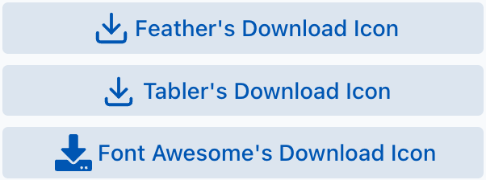
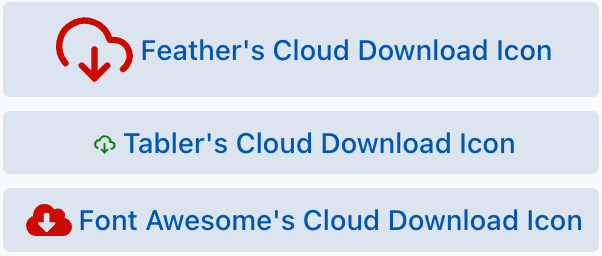
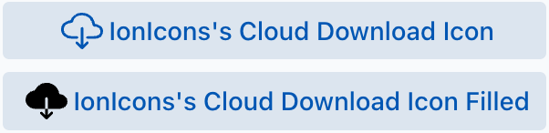
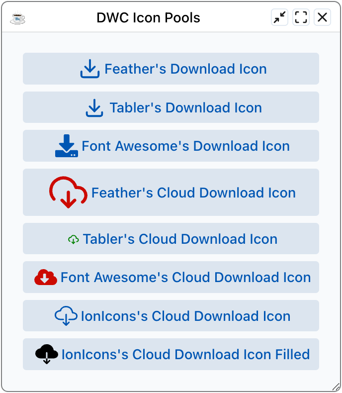

This chapter covers working with icon pools in DWC applications.

## Overview

The DWC provides built-in icon pools that allow you to easily add icons to your BBj controls without needing to manage image files.

## Using Icons in DWC

Icons can be added to controls using HTML syntax:

```bbj
button!.setText("<html><dwc-icon name='sun'></dwc-icon> Light Mode")
```

{/* TODO: screenshot outdated? */}


## Scalable Vector Graphics

The SVG format is an XML-based markup language that describes two-dimensional vector graphics. An SVG file describes how to draw the icon, not what the finished picture looks like. It holds instructions that tell the browser how to create the icon, so the result renders at any size without losing quality or turning blurry. You can therefore add icons to BBj controls at any size. You can size them with CSS custom properties or base the size on a known value, such as the size of the control's text. You can also define fill colors so the icon colors are variable, and you can animate the elements and attributes that make up the SVG. This flexibility makes SVG a good format for icons in controls. For more background, see the [MDN reference for SVG](https://developer.mozilla.org/en-US/docs/Web/SVG).

## Available Icon Pools

You can add the SVG source for an icon to a control's title, but it is much easier to use a pre-existing library. A library usually offers hundreds or thousands of icons that share one design language, so icons from the same library match each other and give the application a consistent look.

The DWC includes several icon pools:

- **Tabler Icons** - A comprehensive set of over 1900 icons
- [**Feather**](https://feathericons.com/) - A free, open-source set of simple icons
- [**Font Awesome**](https://fontawesome.com/icons) - The free icons of Font Awesome. The full Pro set is not free to use.
- `bbj` - A small subset of the Tabler icons

Tabler and Feather are free-to-use, open-source libraries that keep adding new icons. Tabler and Feather icons use their plain names, such as `speakerphone` and `speaker`. Font Awesome names carry a prefix for the style: `fas-` for solid, and the other styles for regular, light, thin, duotone and brands (company logos). For example, `fas-microphone-alt` is the solid microphone icon.

To use an icon from a pool you give the control its content in HTML form. Many BBj controls render HTML, so this is rarely a limitation. The Hello World program from the first chapter does this on its button, with one icon from each of the three pools.

## Icon Syntax

### Basic Usage

```html
<dwc-icon name='icon-name'></dwc-icon>
```

### With Pool Specification

```html
<dwc-icon pool='tabler' name='icon-name'></dwc-icon>
```

## Common Icons

| Icon Name | Description |
|-----------|-------------|
| `sun` | Light mode indicator |
| `moon` | Dark mode indicator |
| `search` | Search functionality |
| `check` | Confirmation/success |
| `x` | Close/cancel |
| `plus` | Add item |
| `minus` | Remove item |
| `arrow-left` | Navigation |
| `arrow-right` | Navigation |

{/* TODO: screenshot outdated? */}


{/* TODO: screenshot outdated? */}


## Styling Icons

Icons can be styled using CSS:

```css
dwc-icon {
    --dwc-icon-color: var(--dwc-color-primary);
    --dwc-icon-size: 24px;
}
```

## Example - Adding Icons to Buttons

```bbj
rem Create a button with an icon
btn! = wnd!.addButton("<html><dwc-icon name='check'></dwc-icon> Save")

rem Create a danger button with icon
deleteBtn! = wnd!.addButton("<html><dwc-icon name='trash'></dwc-icon> Delete")
deleteBtn!.setAttribute("theme", "danger")
```

{/* TODO: screenshot outdated? */}


{/* TODO: screenshot outdated? */}


{/* TODO: screenshot outdated? */}


{/* TODO: screenshot outdated? */}


### Looking up an icon in each pool

To add a download icon to a button, first find a suitable icon. Searching the Feather, Tabler and Font Awesome libraries each turns up an icon named `download`, although the icons differ in appearance. Add the buttons to the window with the icon pool syntax:

```bbj
    rem Define the HTML title for the buttons that incorporate the download icons
        btnIconFeather$ = "<html><dwc-icon pool='feather' name='download'></dwc-icon>"
        btnIconTabler$ = "<html><dwc-icon pool='tabler' name='download'></dwc-icon>"
        btnIconFontAwesome$ = "<html><dwc-icon pool='fa' name='fas-download'></dwc-icon>"
```

```bbj
    rem Now create the buttons using the HTML for the title
        btnFeather! = wnd!.addButton(btnIconFeather$ + "Feather's Download Icon")
        btnTabler! = wnd!.addButton(btnIconTabler$ + "Tabler's Download Icon")
        btnFontAwesome! =  wnd!.addButton(btnIconFontAwesome$ + "Font Awesome's Download Icon")
```

### Size and color

To change the size and color of the icons, set the `expanse` and `theme` attributes, or use an inline style:

```bbj
    rem Define the HTML title for the alternate buttons that incorporate the cloud download icons with extra styling for size/color
        btnIconFeather$ = "<html><dwc-icon pool='feather' name='download-cloud' expanse='l' theme='danger'></dwc-icon>"
        btnIconTabler$ = "<html><dwc-icon pool='tabler' name='cloud-download' style='width: 0.5em; color: green'></dwc-icon>"
        btnIconFontAwesome$ = "<html><dwc-icon pool='fa' name='fas-cloud-download-alt' style='width: 1em; color: var(--dwc-color-danger)'></dwc-icon>"
```

```bbj
    rem Now create the buttons using the HTML for the title
        btnFeather! = wnd!.addButton(btnIconFeather$ + "Feather's Cloud Download Icon")
        btnTabler! = wnd!.addButton(btnIconTabler$ + "Tabler's Cloud Download Icon")
        btnFontAwesome! =  wnd!.addButton(btnIconFontAwesome$ + "Font Awesome's Cloud Download Icon")
```

You can set the icon color either through the `theme` attribute (here `danger`) or with an inline style. The style can use a named color such as `green`, or a CSS custom property such as `var(--dwc-color-danger)`.

## Custom Icon Pools

The built-in pools are not the only choice. If you prefer your own set of icons, or they are not in SVG format, you can define a custom icon pool. It works with SVG, PNG or JPG files. When you create the pool you tell the DWC how to find the icon files, so you can load them from a CDN or from a local Jetty directory.

### Hosting the pool on a CDN

This example uses the [Ionic Ionicons library](https://ionic.io/ionicons), an open source icon library.

1. Find a CDN that hosts the library. The cdnjs service hosts Ionicons in several versions.
2. Find out how to reach the SVG files by name. On cdnjs the SVG files share the prefix `https://cdnjs.cloudflare.com/ajax/libs/ionicons/7.4.0/svg/`, followed by the icon name.
3. Use that information to build the custom pool in your BBj program:

```bbj
    rem Add a custom icon pool referencing the ionicons library from a CDN
    rem @see https://ionic.io/ionicons for the icons
        iconLibraryName! = "ionicons"
        resolverPathCdn! = "https://cdnjs.cloudflare.com/ajax/libs/ionicons/7.4.0/svg/${name}.svg"
        myIconPool! = "(window.Dwc ??= {}).IconsPools ??= []; window.Dwc.IconsPools.push({ name: '" + iconLibraryName! + "', resolver: name => `" + resolverPathCdn! + "` });"
        web! = BBjAPI().getWebManager()
        web!.injectScript(myIconPool!)
```

The program injects JavaScript that adds another icon pool to the DWC. The pool is named `ionicons`, and the prefix URL tells the DWC how to resolve icons by name. The `resolverPathCdn!` variable holds the full CDN path to each icon, and the DWC replaces `${name}` with the name of the icon you request. The `.svg` suffix is part of the variable to reduce the code needed when you specify an icon. This is a choice, not a requirement.

4. Create the buttons with your custom pool name and the icons from the library:

```bbj
    rem Define the HTML title for the buttons that incorporate the bootstrap icons
        btnIconIon1$ = "<html><dwc-icon pool='ionicons' name='cloud-download-outline'></dwc-icon>"
        btnIconIon2$ = "<html><dwc-icon pool='ionicons' name='cloud-download'></dwc-icon>"
```

```bbj
    rem Now create the buttons using the HTML for the title
        btnIonIcon1! = wnd!.addButton(btnIconIon1$ + "IonIcons's Cloud Download Icon")
        btnIonIcon2! = wnd!.addButton(btnIconIon2$ + "IonIcons's Cloud Download Icon Filled")
```

Running the program gives two buttons with custom icons from the CDN.

### Hosting the pool locally

If you downloaded an icon library, or copied a collection of images to a directory under `<BBjHome>/htdocs`, point `resolverPathCdn!` at the local Jetty directory instead. For example, if you extracted the free Font Awesome 6.1.1 library into a directory under Jetty, you could use a value like `/files/icons/fontawesome-free-6.1.1/${name}.svg`. If the library provides PNG files instead, change the suffix in `resolverPathCdn!` so the DWC looks for PNG files whenever you specify an icon for a control.

## Resources

- [Tabler Icons](https://tabler.io/icons) - Browse available icons
- [BASIS Online Help](https://documentation.basis.cloud/BASISHelp/WebHelp/index.htm) - Search for "DWC icons"
