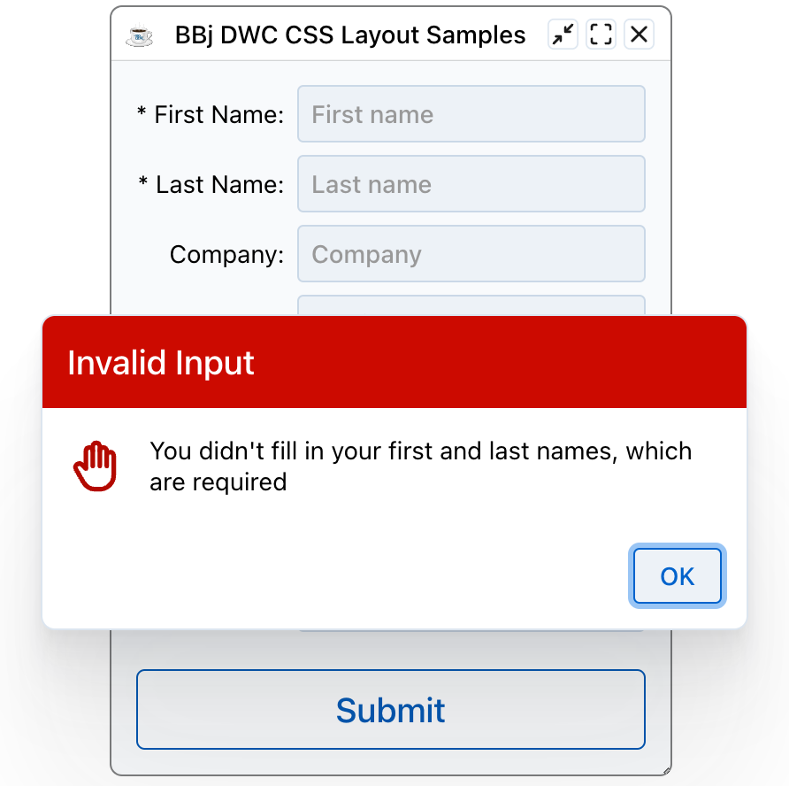
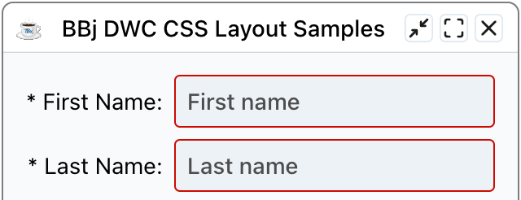
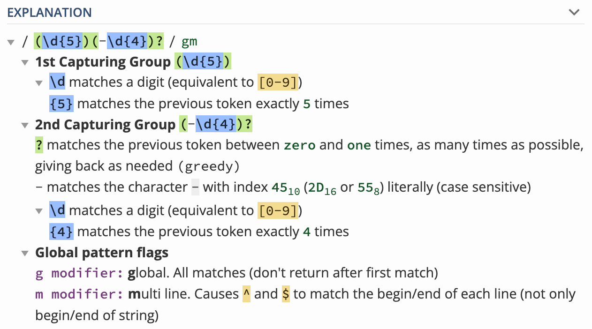
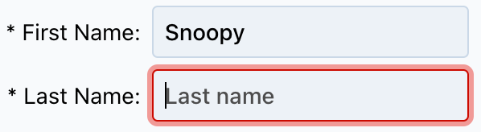
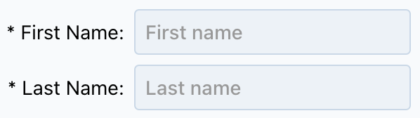
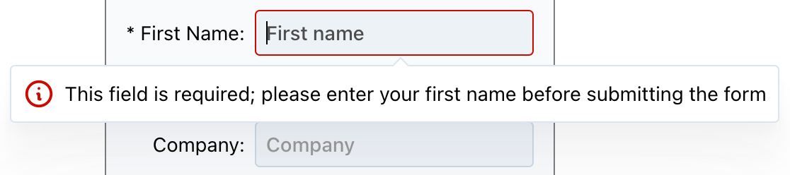
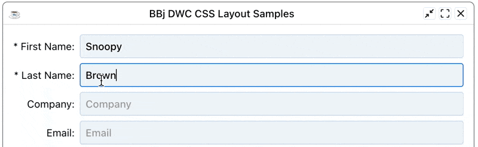
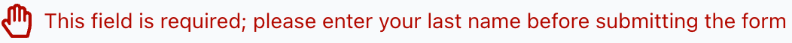
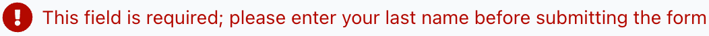
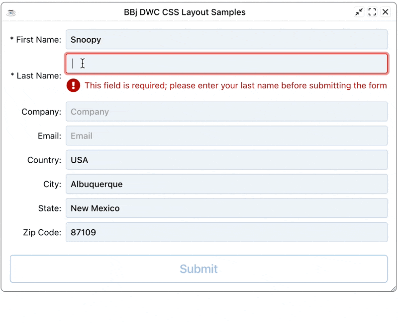

This chapter covers implementing control validation in DWC applications.

## Overview

The DWC provides built-in validation capabilities that allow you to validate user input with visual feedback.

## Form Validation

Form validation makes sure that the information the user filled in is valid before you process it. BBj programs can use server-side validation by setting a callback on a `BBjButton` for the `ON_FORM_VALIDATION` [BBjFormValidationEvent](https://documentation.basis.cloud/BASISHelp/WebHelp/bbjevents/BBjFormValidationEvent/bbjformvalidationevent.htm).

After the user fills out the form and clicks the submit button, the browser sends the form contents to the server and BBj locks the top-level window, which disables all further user input. The callback code for the submit button runs, and the program can read the contents of all input controls from the `BBjFormValidationEvent`. After reviewing the input, the callback decides whether the data is valid and calls the [accept](https://documentation.basis.cloud/BASISHelp/WebHelp/bbjevents/BBjFormValidationEvent/bbjformvalidationevent_accept.htm) method with a 1 for valid data or a 0 for invalid data. After that call, BBj unlocks the top-level window.

This style of form validation has been available since BBj 6.0 and works for all clients. It does all the data processing on the server, so the client has to send the data to the server before it can be validated. Client-side validation can improve on that, as it gives the user instant feedback.

### Example: Form Validation

Register the callback for the form validation event on the submit button:

```bbj
    btnSubmit!.setCallback(BBjButton.ON_FORM_VALIDATION, "OnFormValidation")
```

The callback starts by getting the contents of the first and last name edit boxes from the `BBjFormValidationEvent`. The validation event contains the value of every control on the window, so you can read everything the user entered from the event itself instead of calling each control's `getText()` method. That avoids round trips to the client and matters for performance.

```bbj
    OnFormValidation:
        e! = BBjAPI().getSysGui().getLastEvent()
        firstName! = e!.getText(editFirstName!)
        lastName! = e!.getText(editLastName!)
        if (len(firstName!) AND len(lastName!)) then
            e!.accept(1)
            temp = msgbox("You filled in the form successfully!", BBjSysGui.MSGBOX_ICON_INFORMATION, "Form Submitted Successfully", mode="theme=success")
        else
            e!.accept(0)
            temp = msgbox("You didn't fill in your first and last names, which are required", BBjSysGui.MSGBOX_ICON_STOP, "Invalid Input", mode="theme=danger")
        endif
    return
```

After the code gets the first and last names, it combines the length of each with AND. If either field or both are empty, the result is false, which means the form content is not valid. In that case the code calls `accept()` on the form validation event with a 0 to reject the form, then tells the user that the first two fields are required.

{/* TODO: screenshot outdated? */}


This example is simple. The user could enter a space in each name field and pass the check. A real validation routine would `trim()` the strings and compare their length with a minimum acceptable value.

## Client-Side Validation

Client-side validation gives the user real-time feedback while they fill out a form. They know right away whether the data in a field is invalid, without pressing the submit button to start form validation.

Treat client-side validation as the first of several checks. It improves the user experience by catching problems before the data goes to the server, where a rejection causes a noticeable delay from the round trip. It is not a complete validation solution. For the most secure app, also run a form-level validation on the server after all client-side validations pass.

The DWC offers two types of client-side validation. The browser validates the data before it is sent to the server for form validation:

- Built-in validation, such as setting a `BBjEditBox` to `required` so that it must be filled out to be valid.
- JavaScript validation, where arbitrary developer-defined JavaScript code processes the control's data and returns a boolean that says whether the data is valid.

## Validation Attributes

Controls support validation attributes that provide automatic validation:

| Attribute | Description |
|-----------|-------------|
| `required` | Field must have a value |
| `pattern` | Regex pattern the value must match |
| `min` / `max` | Minimum/maximum values for numbers |
| `minlength` / `maxlength` | Character length constraints |

## Setting Validation

### Required Field

```bbj
editBox!.setAttribute("required", "true")
editBox!.setAttribute("label", "Email Address")
```

### Pattern Validation

```bbj
rem Email pattern
editBox!.setAttribute("pattern", "^[a-zA-Z0-9._%+-]+@[a-zA-Z0-9.-]+\.[a-zA-Z]{2,}$")
editBox!.setAttribute("invalid-message", "Please enter a valid email address")
```

The `pattern` attribute takes a [regular expression](https://developer.mozilla.org/en-US/docs/Web/JavaScript/Guide/Regular_Expressions). Zip codes, for example, follow a distinct pattern: five digits, or five digits followed by a dash and four more digits. A pattern for that:

```bbj
    editZip!.setAttribute("pattern", "(\d{5})(-\d{4})?")
```

With that code in place, the edit box is valid only when it holds a regular zip code (87109) or an extended zip code (87109-1234).

{/* TODO: screenshot outdated? */}


A field with a pattern is also valid when it is empty, unlike a field that is required, because the pattern does not make the field mandatory. If the zip code were a required address part, you would add the `required` attribute as well.

### Testing Regular Expressions

Use [Regex101](https://regex101.com) to test your validation patterns. It tests a pattern live against sample text and explains each part of it. This is the explanation Regex101 shows for the zip code pattern:

{/* TODO: screenshot outdated? */}


## Visual Feedback

When validation fails:
- The control's border changes color (typically red for danger theme)
- The label changes color to match
- An invalid message can be displayed

{/* TODO: screenshot outdated? */}


{/* TODO: screenshot outdated? */}


## Validation States

Controls have three validation states:

1. **Valid** - Input meets all requirements
2. **Invalid** - Input fails validation
3. **Pristine** - Control hasn't been interacted with yet

{/* TODO: screenshot outdated? */}


## Checking Validation in Code

```bbj
rem Check if a control is valid
if (editBox!.isValid()) then
    rem Process the form
else
    rem Show error message
endif
```

## Custom Validation

For complex validation logic:

```bbj
rem Set custom validity
editBox!.setCustomValidity("This username is already taken")

rem Clear custom validity
editBox!.setCustomValidity("")
```

{/* TODO: screenshot outdated? */}


{/* TODO: screenshot outdated? */}


## Example - Email Validation

```bbj
rem Create email input with validation
email! = wnd!.addEditBox("")
email!.setAttribute("label", "Email")
email!.setAttribute("required", "true")
email!.setAttribute("type", "email")
email!.setAttribute("invalid-message", "Please enter a valid email")
```

{/* TODO: screenshot outdated? */}


{/* TODO: screenshot outdated? */}


## Controlling When Validation Runs

With `required` set on both name fields, the form cannot be submitted unless both are filled in. If you fill in only the first name, the empty last name turns red to show it is invalid.

When the app first starts, the empty name fields are not marked as invalid. A field shows as invalid only after it gets focus, receives a character, and is emptied again. That is arguably correct, because you do not necessarily want to greet users with a form full of invalid entries. If you do want that, three more attributes of the edit box fine-tune the validation behavior:

| Attribute | Description | Type | Default |
|-----------|-------------|------|---------|
| `auto-validate` | When true, the control is validated with every change | boolean | true |
| `auto-validate-on-load` | When true, the control is validated when it loads for the first time | boolean | false |
| `auto-was-validated` | When true, the control switches on the valid property automatically once it has been validated and is valid | boolean | false |

To mark the two name fields as invalid before the user touches the form, set `auto-validate-on-load` to true:

```bbj
    editFirstName!.setAttribute("required", "true")
    editFirstName!.setAttribute("auto-validate-on-load", "true")
    editLastName!.setAttribute("required", "true")
    editLastName!.setAttribute("auto-validate-on-load", "true")
```

## JavaScript Validation

The last style of validation is a developer-defined JavaScript expression. You normally do not need to write JavaScript to use the DWC, but this is an exception, because a JavaScript function you write handles the whole client-side validation. It takes the contents of the control as input, decides whether they are valid, and returns true or false.

This style takes more effort, so use it when the built-in attributes such as `required` or `pattern` are not powerful enough. It also fits when the input must pass several tests to count as valid. To get a feel for it, start with a simple case: replicating the `required` attribute in JavaScript. The function only has to check that the control is not empty. The code also sets a custom validation message.

```bbj
    rem Define the JavaScript function that determines if the provided input
    rem is valid or not.  Since this replicates the "required" attribute, the
    rem JavaScript only has to ensure that the control's contents are not empty.
    js! =       "if (value.trim().length > 0) { "
    js! = js! + "    return true; "
    js! = js! + "} else {"
    js! = js! + "    return false;"
    js! = js! + "} "
    editFirstName!.setClientValidationFunction(js!)
    editFirstName!.setClientValidationMessage("This field is required; please enter your first name before submitting the form")
```

{/* TODO: screenshot outdated? */}


The JavaScript uses an if/else conditional on the length of the trimmed content. The DWC displays the custom message in a popover below the control by default. To change where the message appears relative to the edit box, use the `validation-popover-placement` attribute. The following code shows the popover to the right of the edit box:

```bbj
    editFirstName!.setAttribute("validation-popover-placement", "right")
```

A first name made of spaces is still invalid with this function. That differs from the built-in `required` attribute, which only checks that the control is not empty. The JavaScript function goes one step further and removes leading and trailing spaces with `trim()`, so it is a little stricter.

You can also write the function in a much more compact form. This version drops the if/else conditional. It returns the length of the trimmed input: an empty string has a length of zero and is invalid, and any other length counts as valid. The last line sets the validation style to `inline` instead of the default `popover`:

```bbj
    rem The first example could be written in a much more compact manner, so
    rem we'll use that version for the last name.  Our function is simply
    rem using the trim() method to remove leading and trailing spaces, then
    rem returning the length property of the trimmed input.  That satisfies
    rem our boolean return value, as an empty string has a zero length and
    rem thus would be invalid.  Any other length value would resolve to true.
    rem Additionally, we'll change this message to be inserted in the form
    rem as an inline element instead of a popover.
    editLastName!.setClientValidationFunction("return value.trim().length;")
    editLastName!.setClientValidationMessage("This field is required; please enter your last name before submitting the form")
    editLastName!.setAttribute("validation-style", "inline")
```

With the inline style, the DWC inserts the error message just below the edit box instead of showing it in a small floating window. The following animation shows that clearing the last name box makes the control invalid, and that spaces alone stay invalid because of `trim()`. The next field shifts down and the message appears directly under the associated edit box.

{/* TODO: screenshot outdated? */}


## Validation Customization

The previous example changed the validation style from popover to inline and supplied a custom message. The DWC offers more parameters. For example, the `validation-icon` attribute changes the icon that is displayed with the error message. Each of the following three samples produces a custom icon from the Font Awesome pool, followed by the resulting error message:

```bbj
editLastName!.setAttribute("validation-icon", "fa:thumbs-down")
```

{/* TODO: screenshot outdated? */}


```bbj
editLastName!.setAttribute("validation-icon", "fa:hand-paper")
```

{/* TODO: screenshot outdated? */}


```bbj
editLastName!.setAttribute("validation-icon", "fa:fas-exclamation-circle")
```

{/* TODO: screenshot outdated? */}


These examples use the Font Awesome icon pool, but you can also choose icons from the Tabler, Feather or `bbj` pools. You can also give the icon as a URL or as a data URL with base64-encoded image data. The following code uses a truncated data URL to save space:

```bbj
    base64Icon! = "data:image/png;base64,iVBOR..."
    editLastName!.setAttribute("validation-icon", base64Icon!)
```

The result is a customized error message with a custom PNG image that was converted to base64.

{/* TODO: screenshot outdated? */}


## Disabling the Submit Button

The `validation-auto-disable` attribute is false by default. When you set it to true, the submit button of the form stays disabled until the control has valid contents.

You can also set these attributes on the closest `BBjWindow` instead of on each control. When you set an attribute on a window, prefix its name with `data-`.

To try this, add the following line to the program:

```bbj
    window!.setAttribute("data-validation-auto-disable", "true")
```

Because the attribute is set on the window, the line uses the `data-` prefix. With it in place, the submit button is disabled while the first or last name field is invalid. Once both pass the client-side JavaScript validation, the DWC enables the button.

{/* TODO: screenshot outdated? */}


## Exercise: Adding Validation to an Email Field

Work through [Exercise: Validate an email address](./90-exercise-email-validation.mdx).

## Best Practices

1. **Always provide helpful error messages** - Tell users what's wrong and how to fix it
2. **Validate on blur** - Check fields when the user leaves them
3. **Use appropriate input types** - Email, number, etc. provide built-in validation
4. **Combine client and server validation** - Never trust client-side validation alone
