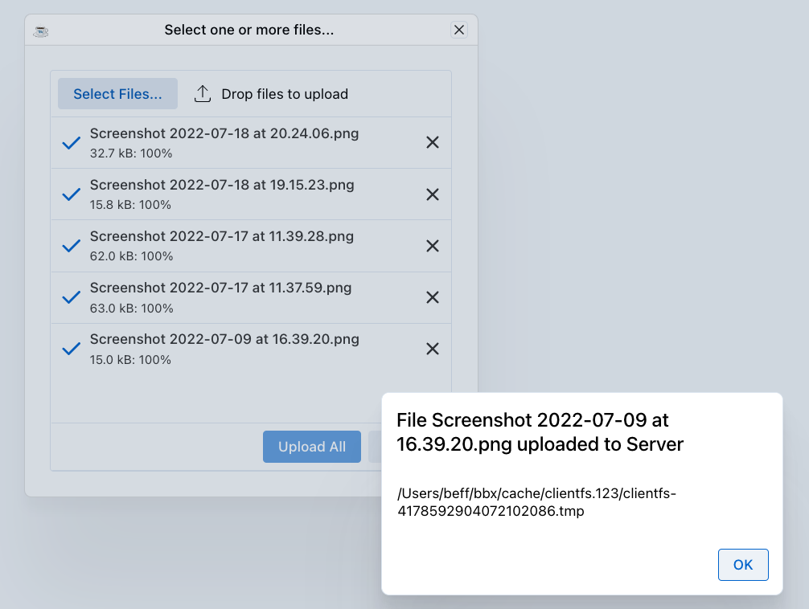

This chapter covers browser constraints and limitations when working with DWC applications.

## Overview

The browser environment has certain constraints that differ from traditional GUI applications. Understanding these constraints helps you design better DWC applications.

## Handling Client Files

The browser does not support direct access to client files. This section describes how to implement file uploads and downloads with DWC.

BBj cannot read files on the client computer directly. To get a file to the client, you download it as you would from a website. Uploading needs a similar process, in which the user selects the file manually and then confirms manually. The reason is security. The BASIS documentation has a chapter on working with client files in BUI, which also applies to the DWC in most respects.



### File Uploads

Use the `BBjFileChooser` control to select client files. The user can also add files by drag and drop. You can set up the control to upload one file or several, and to show a drop zone.

```bbj
rem Create a file chooser for uploads
fileChooser! = wnd!.addFileChooser()
fileChooser!.setCallback(BBjFileChooser.ON_FILE_SELECTED, "onFileSelected")
```

### File Downloads

Downloading a file is much simpler than uploading one. The [`copyToClient()`](https://documentation.basis.cloud/BASISHelp/WebHelp/bbjobjects/bbjclientfile/bbjclientfile_copytoclient.htm) method of `BBjClientFile` does a simple download in BUI and the DWC. Get the `BBjClientFile` from `BBjAPI().getThinClient().getClientFileSystem().getClientFile(clientFileName$)`.

```bbj
rem Trigger a file download
web! = BBjAPI().getWebManager()
web!.download(serverFilePath$, clientFileName$)
```

## Printing and Print Preview

A browser has no direct access to the local printers on the client. The typical way to print from a modern browser application is through a PDF document that the browser displays in a preview. From there, the browser lets the user print the document on the printer of their choice.

For SysPrint, BBj takes this route automatically. In BUI and the DWC, the following snippet creates a SysPrint output and shows it in the browser, even though the program does not specify `PREVIEW`:

```bbj
lp = unt
open (lp,mode="PDF")"LP"
print (lp)"HELLO"
close (lp)
```

From the browser, the user can view and print the document.

Modern webapp printing is typically done by:

1. Displaying the printout in the client
2. Using the browser's print selection

### Printing Options

| Method | Description |
|--------|-------------|
| `SYSPRINT` | Server-side printing |
| `BBjPrinter` | BBj's printer interface |
| `Jasper Reports` | Generate PDF reports for download |

### Print Preview

As a general solution, all BBj printing capabilities (Jasper, SysPrint and `BBjPrinter`) can create PDF documents on the server. Once the document is on the server, the [BBjDocViewer](https://github.com/BBj-Plugins/BBjDocViewer) plug-in can show it in a similar preview on the client. Install it with the Plug-In Manager and inspect its `demo.bbj` for more information about how to use it. The BBJasper print preview also works with its known features in the DWC.

```bbj
rem Generate a PDF for preview
rem Then download or display in browser
web!.download(pdfPath$, "report.pdf")
```

## Security Constraints

Browsers enforce security policies that affect DWC apps:

- **Same-Origin Policy** - Restricts cross-domain requests
- **HTTPS Requirements** - Some features require secure connections
- **Cookie Limitations** - Third-party cookie restrictions

## Local Storage

For storing client-side data:

```bbj
rem Store data in browser
web!.setSessionStorage("key", "value")

rem Retrieve data
value$ = web!.getSessionStorage("key")
```

## Clipboard Access

Clipboard operations require user interaction:

```bbj
rem Copy to clipboard (requires user gesture)
web!.copyToClipboard(text$)
```

## Best Practices

1. **Design for the web** - Don't expect desktop behaviors
2. **Handle offline scenarios** - Consider network interruptions
3. **Use progressive enhancement** - Basic functionality should work everywhere
4. **Test on multiple browsers** - Chrome, Firefox, Edge, Safari
