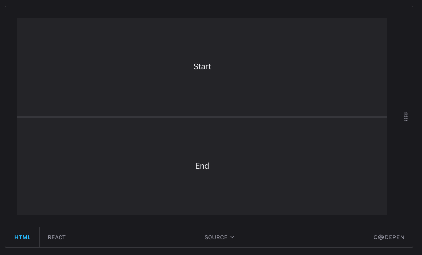
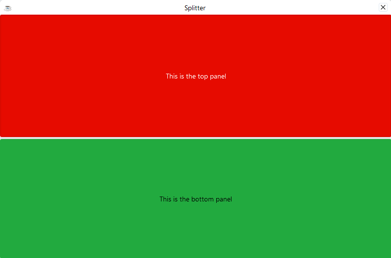

This chapter covers embedding third-party JavaScript components like charts, maps, and widgets into DWC applications.

## Overview

DWC can embed third-party components like charts, maps, and widgets that have been written in JavaScript or TypeScript and run in the browser.

## Using the BBjHTMLView to Embed Third-Party Components

You embed third-party components in BBj with the [BBjHTMLView](https://documentation.basis.cloud/BASISHelp/WebHelp/bbjobjects/Window/bbjhtmlview/bbjhtmlview.htm) control. The concept is not limited to the DWC. It works in principle the same way in the GUI client, which loads a Chromium engine for that purpose, and in BUI.

The `BBjHTMLView` is a widget that acts like an embedded browser. You can load HTML code into it, execute JavaScript, and even send events from JavaScript back to the BBj interpreter.

Embedding an HTML component in BBj typically takes these steps:

1. Add a `BBjHTMLView` to your BBj window.
2. Seed the HTML view with any necessary static HTML code.
3. Load the required JavaScript library.
4. Execute JavaScript to initialize the component.
5. Optionally, register events that the component can fire in that JavaScript code, and add callback routines for them to your BBj program.

Step 3 must only run once step 2 is finished, and step 4 runs after step 3. To guarantee that order, use the following pattern. First seed the HTML view and register callbacks for the page loaded and the script loaded events:

```bbj
html$ = "<html><body><div id='myComponent'></div></body></html>"
htmlview! = window!.addHtmlView(102,20,70,760,430,html$,$$)
htmlview!.setCallback(htmlview!.ON_PAGE_LOADED,"handlePageLoaded")
htmlview!.setCallback(htmlview!.ON_SCRIPT_LOADED,"handleScriptLoaded")
```

The two callback routines then form the cascade:

```bbj
process_events

handlePageLoaded:
  rem after the initial HTML is loaded we can inject the library
  htmlview!.clearCallback(htmlview!.ON_PAGE_LOADED)
  url$ = "https://cdn.url.for.libary.js"
  htmlview!.injectUrl(url$,1)
return

handleScriptLoaded:
  rem after the library is loaded we can work with it
  htmlview!.clearCallback(htmlview!.ON_SCRIPT_LOADED)
  js$ = ""
  js$ = js$ + "var chartCanvas = document.getElementById('myComponent');"
  js$ = js$ + "/// and further js code to execute...."
  htmlview!.injectScript(js$,1)
return
```

The cascade of events, one for the page loaded followed by one for the script loaded, ensures that each part that relies on the previous one runs only after the previous step has finished.

## Embedding a JavaScript Chart Component

This section explains how to embed a chart from the Charts.js library.

The example embeds a chart widget with the Chart.js library. It follows the [Getting Started](https://www.chartjs.org/docs/latest/getting-started/) document of Chart.js. The sequence of loading code starts with a `<canvas>` element and gives it an ID that the JavaScript code can address later:

```bbj
html$ = "<html><head></head><body><canvas id='myChart'></canvas></body></html>"
htmlview! = window!.addHtmlView(102,20,70,760,430,html$,$$)
```

If you plan to embed several similar components on your page, give each one a unique ID.

### Setup

1. Include the Chart.js library
2. Create a container element
3. Initialize the chart with data

### Example: Charts.js Integration

```bbj
use java.nio.file.Files
use java.nio.file.Paths

rem Get WebManager
web! = BBjAPI().getWebManager()

rem Inject Chart.js library
web!.injectUrl("https://cdn.jsdelivr.net/npm/chart.js", 1, "module")

rem Create container for chart
chartDiv! = wnd!.addHtmlView("<canvas id='myChart'></canvas>")

rem Initialize chart with JavaScript
chartJs$ = "const ctx = document.getElementById('myChart');"
chartJs$ = chartJs$ + "new Chart(ctx, { type: 'bar', data: {...} });"
web!.executeScript(chartJs$)
```

After the page is loaded, the `ON_PAGE_LOADED` event fires, and you can load the library from a CDN:

```bbj
handlePageLoaded:
  rem after the initial HTML is loaded we can inject the library
  htmlview!.clearCallback(htmlview!.ON_PAGE_LOADED)
  url$ = "https://cdnjs.cloudflare.com/ajax/libs/Chart.js/3.5.1/chart.min.js"
  htmlview!.injectUrl(url$,1)
return
```

To host the library locally, download it and put it somewhere under the `htdocs` folder of the BBj installation. The URL then looks like this:

```bbj
url$ = "http://bbjservername:8888/files/chart.min.js"
```

After the library loads successfully, the `ON_SCRIPT_LOADED` event fires. Now you can work with the library and instantiate the chart with JavaScript. The sample hardcodes the data. In a real program you would either build the data dynamically into the JavaScript code or load it later with `executeScript`.

```bbj
handleScriptLoaded:
  rem after the library is loaded we can work with it
  rem ' https://www.chartjs.org/docs/latest/getting-started/

  htmlview!.clearCallback(htmlview!.ON_PAGE_LOADED)
  js$ = ""
  js$ = js$ + "var chartCanvas = document.getElementById('myChart');"
  js$ = js$ + "var ctx = chartCanvas.getContext('2d');"
  js$ = js$ + "var chart = new Chart(ctx, {"
  js$ = js$ + "    type: 'line',"
  js$ = js$ + "    data: {"
  js$ = js$ + "        labels: ['January', 'February', 'March', 'April', 'May', 'June', 'July'],"
  js$ = js$ + "        datasets: ["
  js$ = js$ + "         {"
  js$ = js$ + "            label: 'Year 2021',"
  js$ = js$ + "            backgroundColor: '#ff1a68',"
  js$ = js$ + "            borderColor: '#ff1a68',"
  js$ = js$ + "            data: [40, 20, 33, 22, 25, 15, 7]"
  js$ = js$ + "         },"
  js$ = js$ + "         {"
  js$ = js$ + "            label: 'Year 2022',"
  js$ = js$ + "            backgroundColor: '#25c2a0',"
  js$ = js$ + "            borderColor: '#25c2a0',"
  js$ = js$ + "            data: [2, 10, 5, 2, 20, 30, 45]"
  js$ = js$ + "         },"
  js$ = js$ + "        ]"
  js$ = js$ + "    }"
  js$ = js$ + "});"
  js$ = js$ + "window.myChart = chart;"

  htmlview!.injectScript(js$,1)
return
```

## Receiving Events from JavaScript in BBj

Sometimes a component allows for interactivity with the user. In many cases, this interactivity needs to trigger actions inside your BBj program.

A JavaScript component can send events back to BBj, so you can react to user interaction in your BBj program. The BASIS documentation has a [sample](https://documentation.basis.cloud/BASISHelp/WebHelp/bbjevents/BBjNativeJavaScriptEvent/BBjNativeJavaScriptEvent_getEventMap.htm). Chart.js is a special case where BASIS still recommends the `BBjHTMLView`, because it is not directly a web component. The `EventMapSample.bbj` program shows how to include normal HTML components and inject JavaScript functions into them.

The relevant section in the enhanced chart sample is this part of the JavaScript code:

```bbj
  js$ = js$ + "        onClick: (evt, item) => {"
  js$ = js$ + "         Chart.defaults.plugins.legend.onClick.call(this, evt, item, this);"
  js$ = js$ + "         const customEvent = new CustomEvent('legend-clicked',{"
  js$ = js$ + "           detail:{text: item.text, index: item.datasetIndex, hidden: item.hidden}"
  js$ = js$ + "         });"
  js$ = js$ + "         window.basisDispatchCustomEvent(chartCanvas, customEvent);"
  js$ = js$ + "        }"
```

The key statement is `basisDispatchCustomEvent`, which passes the `customEvent` object back to BBj. In the event handler for the [ON_NATIVE_JAVASCRIPT](https://documentation.basis.cloud/BASISHelp/WebHelp/bbjevents/BBjNativeJavaScriptEvent/BBjNativeJavaScriptEvent.htm) event you can then work with the event object:

```bbj
handleNativeJavascript:
  event! = sysgui!.getLastEvent()
  name$ = event!.getEventName()
  map! = event!.getEventMap()
  detail! = map!.get("detail")
  let x=MSGBOX(detail!, 0, "Event Details")
return
```

This handler only shows the contents of the event object in a `MSGBOX` for illustration.

### Setting Up Event Communication

```bbj
rem Register a custom event handler
web!.registerEvent("chartClick", "onChartClick")

rem In JavaScript, trigger the event
rem BBj.send('chartClick', { data: clickedData })
```

### Callback Handler

```bbj
onChartClick:
    event! = BBjAPI().getLastEvent()
    data! = event!.getData()
    rem Process the click data
return
```

## Working with Slots

Slots allow you to insert content into specific locations within web components.

When you embed a web component or a third-party library, you sometimes need to put a BBj control such as a `BBjChildWindow` "in the middle" of the other control. That "in the middle" is a slot. A tab control or an accordion, for example, makes areas inside it visible or invisible depending on its state. For a BBj developer, these areas should be `BBjChildWindow` controls so that BBj can control them.

### Using Slots

```bbj
rem Create a component with slots
html$ = "<my-component>"
html$ = html$ + "  <span slot='header'>Header Content</span>"
html$ = html$ + "  <span slot='content'>Main Content</span>"
html$ = html$ + "</my-component>"
htmlView! = wnd!.addHtmlView(html$)
```

### Example for Slots: a Splitter Component from Shoelace

The [Shoelace library](https://shoelace.style/) is a set of web components that you can combine with BBj in the way you have learned so far. Create a `BBjHTMLView`, load the library from a CDN, then use HTML and JavaScript to show the control in the browser.

A splitter component divides the screen or an area into two parts and lets the user change the ratio between them with a divider. With Shoelace you can create a horizontal [split panel](https://shoelace.style/components/split-panel) in HTML:



Where the screenshot shows the labels "Start" and "End," a BBj developer expects a `BBjChildWindow` that can hold arbitrary BBj controls. The problem is that a control or child window you create on a window appears next to the other elements. There is no direct way to create it inside another element.

The trick is to use JavaScript to put a `BBjChildWindow` into the slot of the other component:

1. Add two child windows as you always do.
2. Call `getAttribute("id")` to get their IDs in the HTML DOM.
3. Call `appendChild` to move each child window into the other element, which you created with a UUID as its ID.

```bbj
BBjAPI().getSysGui().executeScript(
:"document.getElementById('" + sl_splitter!.getAttribute("id") + "').appendChild(document.getElementById('" + top!.getAttribute("id") + "'));"+
:"document.getElementById('" + sl_splitter!.getAttribute("id") + "').appendChild(document.getElementById('" + bottom!.getAttribute("id") + "'));")
```

If you want to use `getAttribute("id")`, call `setAttribute("id", "your id here")` first.

The result is a splitter with two child windows, each hosting a full-size button:



## Popular Libraries to Embed

| Library | Use Case |
|---------|----------|
| **Chart.js** | Charts and graphs |
| **Leaflet** | Interactive maps |
| **DataTables** | Enhanced data tables |
| **FullCalendar** | Calendar widgets |
| **Quill** | Rich text editor |

## Exercise: Embed a Third-Party Component {#exercise-embed-a-3rd-party-component}

Work through [Exercise: Embed a third-party component](./90-exercise-embed-component.mdx).

## Best Practices

1. **Use CDN links** for popular libraries
2. **Check licensing** before using libraries commercially
3. **Handle loading states** - Libraries may take time to load
4. **Fallback gracefully** - Handle cases where libraries fail to load
