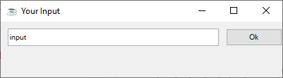

Now it's time to write our first graphical object oriented program in BBj. We develop a small dialog to take user input and return it to the calling program:

Watch the video about how it's developed:

<YouTube id="z3g51m9Mc_0" title="BBx Clues 8: An Object-Oriented Dialog Class in BBj" />

In the download you find a ZIP file which contains the three programs from this chapter. Load the `MyDialog.bbj` program into your IDE and examine it. Can you improve it?

This ZIP contains

- `Car.bbj`
- `CarApplication.bbj`
- `MyDialog.bbj`

as shown in the three videos.

[Download oo-samples.zip](pathname:///files/intro-bbj/oo-samples.zip)
