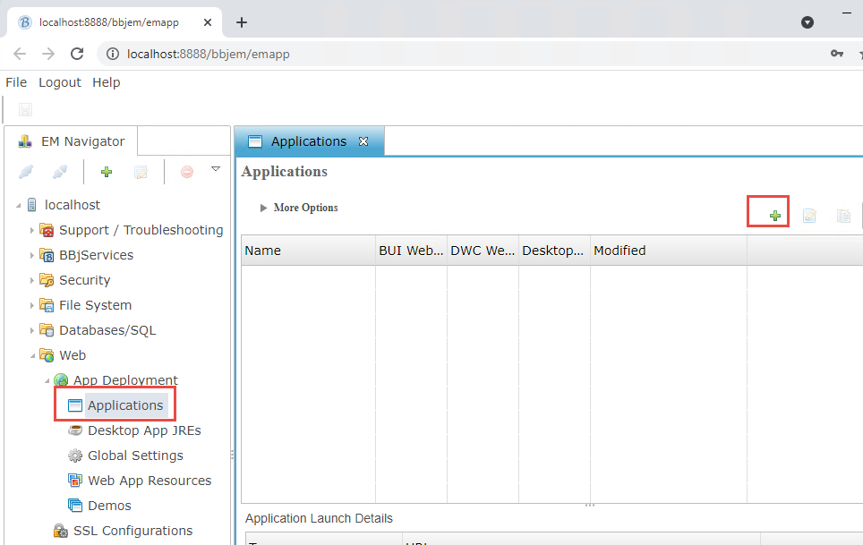
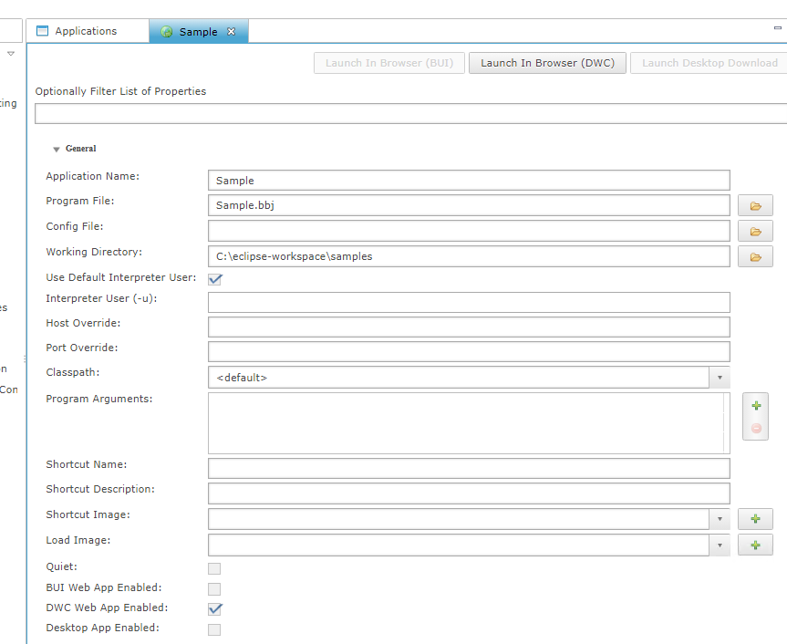

BBj's DWC web client allows to develop for the Web using BBj's comprehensive, simple language. BBj handles backend and frontend, so the developer can simply write a small BBj program, register events, and run it in the browser. BBj does everything else.

Any of the programs you wrote in this course can be started in the DWC client. To deploy your program in the web follow these steps:

1. Start Enterprise Manager: `http://localhost:8888/bbjem/em`
2. Log in using admin / admin123 as credentials
3. Navigate to "Web" - "Applications" and hit the "+" Sign:  
   
4. In the dialog, give your app a Name, point it to the program file and set the working directory. Check "DWC enabled":  
   
5. The URL pattern would be `http://localhost:8888/webapp/Sample` for the parameters above.

**Try to configure one of your prior sample programs from the prior sessions. Does it run?**
