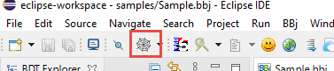

This is the file with which the lesson starts.

[Download dwc-lesson-start.zip](pathname:///files/intro-bbj/dwc-lesson-start.zip)

All samples we wrote so fare use pixel oriented layout for the x,y positions of the controls and the sizes of everything. Now let's have a look how to use BBj's web client to apply CSS-based layout and styling.

Let's use the following program:

```bbj
wnd! = BBjAPI().openSysGui("X0").addWindow(10,10,800,600,"Hello BBj DWC")
st! = wnd!.addStaticText(wnd!.getAvailableControlID(),10,10,200,20,"Vorname:")
ed_vorname! = wnd!.addEditBox(wnd!.getAvailableControlID(),210,10,200,20,"")
st! = wnd!.addStaticText(wnd!.getAvailableControlID(),10,40,200,20,"Name:")
ed_name! = wnd!.addEditBox(wnd!.getAvailableControlID(),210,40,200,20,"")
btn! = wnd!.addButton(wnd!.getAvailableControlID(),10,70,400,30,"Say Hello")
wnd!.setCallback(BBjAPI.ON_CLOSE,"byebye")
btn!.setCallback(BBjAPI.ON_BUTTON_PUSH,"sayhello")
process_events

byebye: bye

sayhello:
    vorname$=ed_vorname!.getText()
    name$=ed_name!.getText()
    a=msgbox("Hello "+vorname$+" "+name$,64,"Hello World")
return
```

This program contains two input fields and a button, and uses pixel-orientes layout instructtions as we have learned before.

Load it into your IDE and try to run it in GUI and in the Web client like we have seen before.

Hint: the Spiderweb-Button in Eclipse does the deployment steps from the prior chaper for you, but starts the (older) BUI version of the program. You might still find it useful to skip the manual setup in Enterprise Manager and let this button do the work for you.


