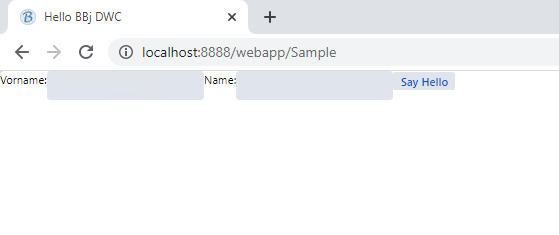

There is a flag you can set to BBj's [addWindow](https://documentation.basis.cloud/BASISHelp/WebHelp/bbjobjects/SysGui/bbjsysgui/bbjsysgui_addwindow.htm) method to tell it that you do not want BBj to do the layout with pixels but with CSS.

We start with changing the addWindow - line in our Program as follows:

```bbj
wnd! = BBjAPI().openSysGui("X0").addWindow(10,10,800,600,"Hello BBj DWC",$01101083$)
```

Follow the link above to the documentation of [addWindow](https://documentation.basis.cloud/BASISHelp/WebHelp/bbjobjects/SysGui/bbjsysgui/bbjsysgui_addwindow.htm) and locate the flags. We set $01101083$ which combines a few flags. We want the window to have no title bar, and to start maximized, but the important one we need for CSS layout and positioning is

$00100000$ - Automatically arranges all controls and child windows placed in the window to fit.

*(The documentation currently (09/2021) is a little unclear about the meaning for the Web Client, we expect this to become more verbose soon. It's WIP.)*

**Change this line in your program and run it. What happens in GUI, what happens as a /webapp ?**

You should see something like this:


