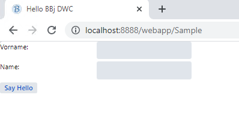

Let's apply a CSS grid layout to our program. If you are not familiar with CSS grid, you may now read about it online, e.g. here:

[https://css-tricks.com/snippets/css/complete-guide-grid/](https://css-tricks.com/snippets/css/complete-guide-grid/)

All we need to do is tell the Window to apply CSS grid layout. In total, we want to set these three properties (read about them on the page behind the link above if you're unsure what they do):

```css
display=inline-grid
grid-template-columns=1fr 1fr
gap=5px
```

How do we apply them to the Window? In order to understand this step, you need to know that:

- each BBjTopLevelWindow and BBjChildWindow creates three nested \<div>-Containers in the browser
- you can set Styles directly to these div containers.
- you use setPanelStyle to directly set style directives to the inner \<div>container in the DOM

So to set the three properties above to the inner div of the panel, you add the following lines to your program, right after the window is created:

```bbj
wnd!.setPanelStyle("display","inline-grid")
wnd!.setPanelStyle("grid-template-columns","1fr 1fr")
wnd!.setPanelStyle("gap","5px")
```

Add these three lines and you should see:


