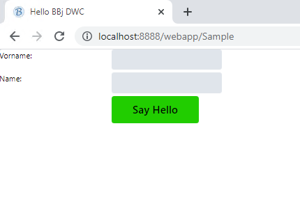

BBj Controls are implemented as HTML5 Web Components (see [https://developer.mozilla.org/en-US/docs/Web/Web_Components](https://developer.mozilla.org/en-US/docs/Web/Web_Components) for more information and useful links about this standard).

Web Components hide certain implementation details from the outside world, which also is a best-practice for the object oriented paradigm we heard about in the previos lesson.

The BBj controls expose certain attributes that can be used for theming and to control certain behaviors. The web components that are shipped with BBj are documented on these pages:

[https://basishub.github.io/basis-next/#/dwc/](https://basishub.github.io/basis-next/#/dwc/)

If you look at the docs for the BBj Button you see that it exposes certain attributes, for instance a "theme" and an "expanse". Let's change these two to make it bigger and "green" (in the default BBj theme). Properties can be set with [setAttribute](https://documentation.basis.cloud/BASISHelp/WebHelp/bbjobjects/SysGui/bbjcontrol/BBjControl_setAttribute.htm):

```bbj
btn!.setAttribute("expanse","xl")
btn!.setAttribute("theme","success")
```

With this change, the result looks like this:



**Can you add some margin to the block controls and change the background color window?**
