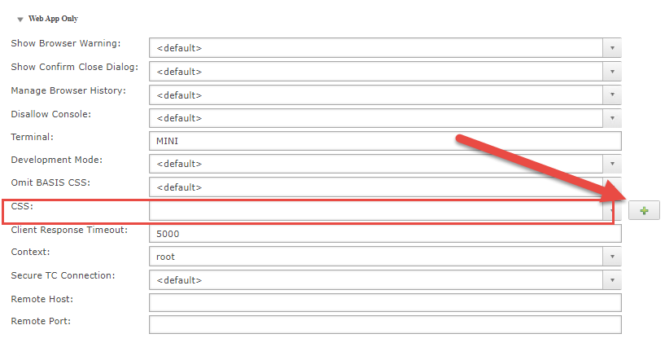

The setStyle / setPanelStyle / setDockStyle instructions directly set the style properties in the element tags of the DOM. Now we learn how to add a CSS class to a control and a window panel, and how to define the properties for such a class in an external CSS file.

Let's first create a simple CSS file `sample.css` with the following content

```css
.mypanel{
 display:inline-grid;
 grid-template-columns:1fr 1fr;
 gap:5px;
}
```

As you see we have now created a CSS class with the grid instructions we had added to the code before .

Now the three lines with the according "setStyle" instructions can be changed to the following single line:

```bbj
wnd!.addPanelStyle("mypanel")
```

In the last step we need to tell BBj to use our CSS file with this program. There are various ways to do that, but let's start with adding it in Enterprise Manager to the app directly, in the "Web App Only" section of the Application:



Add it using the "Plus" Button, save the setting and rerun the program from the link in the browser.

You should again see the program with the nice grid layout.

Now you can also add more CSS instructions to that CSS file, especially [media-queries](https://www.w3schools.com/css/css_rwd_mediaqueries.asp) if you need to do a truly responsive page that adjusts to phones and tablets and wide screens.

Note: If you deploy the CSS file in Enterprise Manager, it will not be reloaded if you change it on disk unless you redeploy it in Enterprise Manager or restart your service. As soon as we will cover BBj Plug-Ins we will learn about a plug-in that you will find helpful for that problem.

For the time being you can add the following to the beginning of your program (adjust the names for the app link name and the CSS file to your situation):

```bbj
::BBUtils.bbj::BBUtils.applyCss("Sample", "sample.css", 1)
```

What this does is basically re-register the CSS file with every start. Now after a change in the CSS file, simply reload the app twice (once to execute the statement, then to see the result of the reload) and you're all set.

The two files that contain the results of this lesson.

[Download `dwc-lesson-result.zip`](pathname:///files/intro-bbj/dwc-lesson-result.zip)
